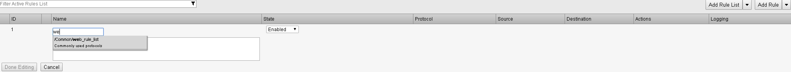
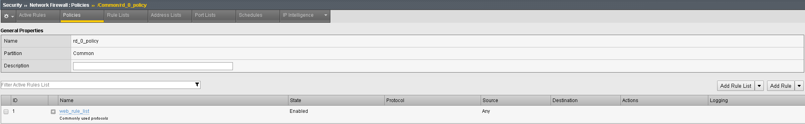

Create a Policy with a Rule List
--------------------------------

Policies are a way to group a set of individual rules together and apply
them to the active policy base as a group. A typical use of a policy
list would be for a set of rule lists that have common requirements for
access protocols and ports.

Create a policy list to allow the traffic you created in the rule list
in the previous section. A logical container must be created before the
individual rules can be added. First you need to create a container for
the policy by going to:

**Security > Network Firewall > Policies** and select **Create.**

You’ll notice that before Milton detached from Initech, he created a
global policy named **‘Global’** to allow basic connectivity to make
troubleshooting easier.

For the **Name** enter **rd_0_policy**, provide an optional description
and then click **Finished.
(Note: We commonly use “RD” in our rules to help reference the “Route
Domain”, default is 0)**

|image13|

Edit the **rd_0_policy** by selecting it in the Policy Lists table, then
click the **Add Rule List** button. Here you will add the rule list you
created in the previous section. For the **Name,** start typing
**web_rule_list**, you will notice the name will auto complete, select
the rule list **/Common/web_rule_list**, provide an optional description
and then click **Done Editing.**

|image14|

When finished your policy should look like the screen shot below.

|image15|

You will notice the changes are unsaved and need to be committed to the
system. This is a nice feature to have enabled to verify you want to
commit the changes you’ve just made without a change automatically being
implemented.

To commit the change, simply click **“Commit** Changes **to System”**
located at the top of the screen.

|image16|

Once committed you’ll notice the rule now becomes active and the
previous commit warning is removed.

|image17|

.. |image13| image:: ../images/image14.png
   :width: 4.92847in
   :height: 1.35694in

.. |image15| image:: ../images/image16.png
   :width: 6.5in
   :height: 1.29653in
.. |image16| image:: ../images/image17.png
   :width: 6.49097in
   :height: 0.47222in

