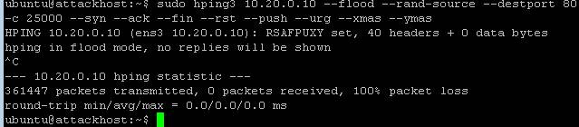

Simulating a Christmas Tree Packet Attack
~~~~~~~~~~~~~~~~~~~~~~~~~~~~~~~~~~~~~~~~~

Joanna was feeling festive this morning. In this example, we’ll set the
BIG-IP to detect and mitigate Joanna’s attack where all flags on a TCP
packet are set. This is commonly referred to as a Christmas Tree Packet
and is intended to increase processing on in-path network devices and
end hosts to the target.

We’ll use the hping utility to send 25,000 packets to our server, with
random source IPs to simulate a DDoS attack where multiple hosts are
attacking our server. We’ll set the SYN, ACK, FIN, RST, URG, PUSH, Xmas
and Ymas TCP flags.

1.  In the BIG-IP web UI, navigate to **Security** > **DoS Protection**
    > **Device Configuration** > **Network Security**.

2.  Expand the **Bad-Header-TCP** category in the vectors list.

3.  Click on the **Bad TCP Flags (All Flags Set)** vector name.

4.  Configure the vector with the following parameters:

    - State: Mitigate
    - Threshold Mode: Fully Manual
    - Detection Threshold EPS: Specify 50
    - Detection Threshold Percent: Specify 200
    - | Mitigation Threshold EPS: Specify 100
      | |image80|

5.  Click **Update** to save your changes.

6.  Open the BIG-IP SSH session and scroll the ltm log in real time with
    the following command: tail -f /var/log/ltm

7.  | On the attack host, launch the attack by issuing the following command on the BASH prompt:
    | ``sudo hping3 10.20.0.10 --flood --rand-source --destport 80 -c 25000 --syn --ack --fin --rst --push --urg --xmas --ymas``

8.  | You’ll see the BIG-IP ltm log show that the attack has been
      detected:
    | |image81|

9.  | After approximately 60 seconds, press **CTRL+C** to stop the
      attack.
    | |image82|

10. Navigate to **Security** > **DoS Protection**> **DoS Overview (you
    may need to refresh or set the auto refresh to 10 seconds).** You’ll
    notice from here you can see all the details of the active attacks.
    You can also modify an attack vector right from this screen by
    clicking on the attack vector and modifying the details in the fly
    out panel.

    |image83|

11. | Return to the BIG-IP web UI. Navigate to **Security** > **Event
      Logs** > **DoS** > **Network** > **Events**. Observe the log
      entries showing the details surrounding the attack detection and
      mitigation.
    | |image84|

12. Navigate to **Security** > **Reporting** > **DoS** > **Analysis**.
    Single-click on the attack ID in the filter list to the right of the
    charts and observe the various statistics around the attack.
    
    
.. |image80| image:: ../images/image78.png
   :width: 2.43392in
   :height: 2.49669in
.. |image81| image:: ../images/image79.png
   :width: 4.48611in
   :height: 0.38889in

.. |image83| image:: ../images/image81.png
   :width: 6.49097in
   :height: 1.10208in
.. |image84| image:: ../images/image82.png
   :width: 5in
   :height: 1.70833in
