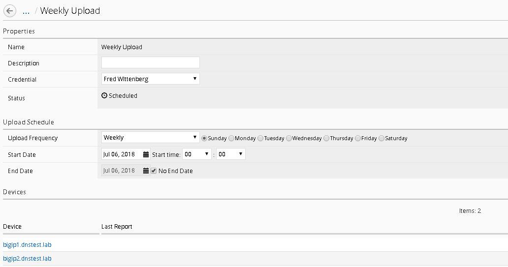

Workflow 2: Uploading QKviews to iHealth for a support case
~~~~~~~~~~~~~~~~~~~~~~~~~~~~~~~~~~~~~~~~~~~~~~~~~~~~~~~~~~~

BIG-IQ can now push qkviews from managed devices to ihealth.f5.com and
provide a link to the report of heuristic hits based on the qkview.
These qkview uploads can be performed ad-hoc or as part of a F5 support
case. If a support case is specified in the upload job, the qkview(s)
will automatically be associated/linked to the support case. In addition
to the link to the report, the qkview data is accessible at
ihealth.f5.com to take advantage of other iHealth features like the
upgrade advisor.

1. Navigate to **Monitoring** **Reports** **Device** **iHealth
   Configuration**

   |image97|

2. Add Credentials to be used for the qkview upload and report retrieval.
   Click the Add button under Credentials.

   |image98|

.. WARNING:: **If you do not have credentials, please raise your hand and speak to an instructor**

3. Fill in the credentials that you used to access https://ihealth.f5.com:

   - Name: Give the credentials a name to be referenced in BIG-IQ
   - Username: <Username you use to access iHealth.f5.com>
   - Password: <Password you use to access iHealth.f5.com>

   |image99|

4. Click the Test button to validate that your credentials work.

5. Click the Save & Close button in the lower right.

6. Click the QKview Upload Schedules button in the BIG-IP iHealth menu.

   **Monitoring** > **Reports** > **Device** > **iHealth** > **QKView Upload
   Schedule**

7. Click Create with the following values

   - Name – Weekly Upload
   - Description – Nightly QKView Upload
   - Credential – (use what was created in step 3)
   - Upload Frequecny – Weekly (Select Sunday)
   - Start Time – Select todays date at 00:00
   - End Date – No End date should be checked
   - Select both devices
   - Click the right arrow to move to the “Selected” Area
   - | Click Save & Close.

  | |image100|

You will now have a fresh set of QKView in iHealth every Sunday morning.
This is extremely useful for when new cases are opened, one less step
you’ll need for support to engage quicker.

.. |image97| image:: ../images/image94.png
   :width: 6.5in
   :height: 2.7in
.. |image98| image:: ../images/image95.png
   :width: 1.88472in
   :height: 0.92639in
.. |image99| image:: ../images/image96.png
   :width: 3.37624in
   :height: 2.14141in

