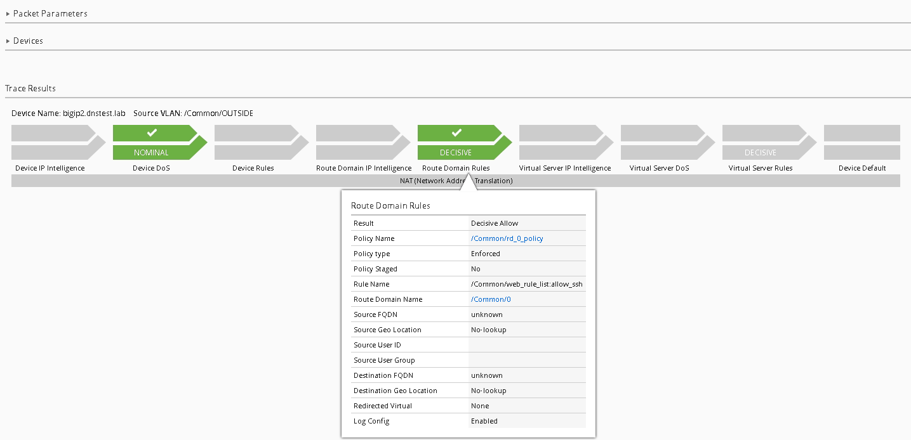
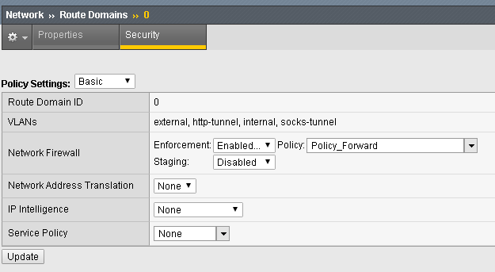
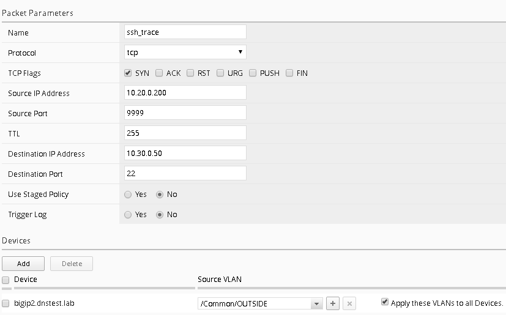

Network Security (AFM) Management Workflows
===========================================

Workflow 1: Managing AFM from BIG-IQ
------------------------------------

Day 4, it turns out no one thought about managing the new web and
application servers, as such SSH is blocked to both devices. Let’s first
validate this by using the packet tester tool within BIG-IQ, note this
is the same tool within BIG-IP with one major exception. Within BIG-IQ
you can trace a packet through **more than one firewall**. This is very
useful if you have multiple AFM devices in a packets path, now you can
test the flow end to end from one central location.

Task 1 – Packet Tracer
^^^^^^^^^^^^^^^^^^^^^^

#. Navigate to **Monitoring > Reports > Security > Network Security > Packet Traces**

   |image109|

#. Click on the “Create” button from the top menu.

#. Complete the following information

   -  Name – ssh_trace
   -  Protocol – tcp
   -  TCP Flags – Syn
   -  Source IP Address – 10.20.0.200
   -  Source Port – 9999 
   -  Destination IP Address – 10.30.0.50 
   -  Destination Port – 22 
   -  Use Staged Policy – No
   -  Trigger Log – No

#. Under the Devices section click “Add” (notice you’ll see all the devices
   with AFM provision listed), for our lab however; just add **bigip2.dnstest.lab**

   |image110|

#. Select the “/Common/OUTSIDE” Vlan as the Source VLAN from the dropdown.

   When completed your screen should look like the screen shot below:

   |image111|

#. Click “Run Trace”

   You can see from the trace results; the traffic is indeed being denied

   |image112|

Another nice feature of Packet Trace within BIG-IQ is the ability to
clone a trace, when you complete the next two tasks, we’ll return to the
packet tracer tool to re-run the results using the clone option.
Additionally, the traces are saved and can be reviewed later, this can
be very helpful in long troubleshooting situations where application
teams are asking for results after changes are made to policies.

Follow the steps below to allow SSH access to both devices using BIG-IQ
as a central management tool.

Task 2 – Modify Rule Lists
^^^^^^^^^^^^^^^^^^^^^^^^^^

#. Navigate to the **Configuration > Security > Network Security > Rule Lists**

#. Notice the previously created rule lists have been imported into BIG-IQ

#. Click on the “\ **application_rule_list**\ ”

#. Click **Create Rule** button.

#. Click on the pencil (edit rule) of the newly created rule listed with **Id** of **2.**

#. Create a new rule with the below information. Be prepared to scroll to find all the options

   +-------------------------+-----------------------+
   | **Name**                | allow_ssh             |
   +=========================+=======================+
   | **Source Address**      | **10.20.0.200**       |
   +-------------------------+-----------------------+
   | **Source Port**         | **any**               |
   +-------------------------+-----------------------+
   | **Source VLAN**         | **any**               |
   +-------------------------+-----------------------+
   | **Destination Address** | **10.30.0.50**        |
   +-------------------------+-----------------------+
   | **Destination Port**    | **22**                |
   +-------------------------+-----------------------+
   | **Action**              | **Accept-Decisively** |
   +-------------------------+-----------------------+
   | **Protocol**            | **TCP**               |
   +-------------------------+-----------------------+
   | **State**               | **enabled**           |
   +-------------------------+-----------------------+
   | **Log**                 | **True (checked)**    |
   +-------------------------+-----------------------+

#. Click **Save & Close** when finished.

#. Repeat the same procedure for the web_rule_list, be sure to change the destination to 10.30.0.50, all other setting remains the same.

Task 3 – Deploy the Firewall Policy and related configuration objects
^^^^^^^^^^^^^^^^^^^^^^^^^^^^^^^^^^^^^^^^^^^^^^^^^^^^^^^^^^^^^^^^^^^^^

Now that the desired firewall configuration has been created on the
BIG-IQ, you need to deploy it to the BIG-IP. In this task, you create
the deployment, verify it, and deploy it.

#. From the top navigation bar, click on **Deployment** (tab).

#. Click on the **EVALUATE & DEPLOY** section on the left to expand it.

#. Click on **Network Security** in the expansion.

   |image113|

#. Click on the top **Create** button under the **Evaluations** section.

#. Give your evaluation a name (ex: **deploy_afm1**).

#. Evaluation **Source** should be **Current Changes** (default).

#. Source Scope should be **All Changes** (default)

#. Remove Unused Objects should be **Remove Unused Objects** (default)

#. Target Device(s) should be **Device**.

#. Select **bigip2.dnstest.lab** from the list of Available devices and move it to Selected area.

   |image114|

#. Click the **Create** button at the bottom right of the page.

   You should be redirected to the main **Evaluate and Deploy** page.

   This will start the evaluation process in which BIG-IQ compares its
   working configuration to the configuration active on each BIG-IP.
   This can take a few moments to complete.

   The **Status** section should be dynamically updating… (What states do you see?)

   Once the status shows **Evaluation Complete** you can view the evaluation results.

   .. NOTE:: Before selecting to deploy, feel free to select the differences indicated to see the proposed deployment changes. This is your check before making changes on a BIG-IP.

#. Click the number listed under **Differences – Firewall**.

#. Scroll through the list of changes to be deployed.

#. Click on a few to review in more detail.

   What differences do you see from the **Deployed on BIG-IP** section and
   on **BIG-IQ**?

   Do you see the new rules you created in BIG-IQ? Ya should…

#. Click **Cancel**.

   Deploy your changes by checking the box next to your evaluation **deploy_afm1**.

#. With the box checked, click the **Deploy** button.

   Your evaluation should move to the **Deployments** section.

   After deploying, the status should change to **Deployment Complete**.

   -  This will take a moment to complete. Once completed, log in to the
      BIG-IP and verify that the changes have been deployed to the AFM
      configuration.

Congratulations, you just deployed your first AFM policy via BIG-IQ!

Review the configuration deployed to the BIG-IP units.

On **bigip2.dnstest.lab**: (https://192.168.1.150)

#. Navigate to Security > Network Firewall > Policies.

#. Click on rd_0_policy and expand the rule lists

   Are the two rules you created in BIG-IQ listed for this newly deployed firewall policy?

   |image115|

   |image116|

Test Access:

#. Open a new Web browser and access http://10.30.0.50
#. Open Putty and access 10.30.0.50

Task 4 – Packet Tracer (continued)
^^^^^^^^^^^^^^^^^^^^^^^^^^^^^^^^^^

#. Navigate to the Monitoring tab Reports Security Network Security Packet
Tracers

#. Highlight the previous trace (ssh_trace) and click on the “Clone” button

   |image117|

   You’ll notice all the previously entered values are pre-populated, you
   now can make any changes if necessary (maybe the application team
   realized the source port of the flow is not random).

#. Click “Run Trace”

   |image118|

SUCCESS!!

The history within the tool makes Root Cause Analysis (RCA) reports very
easy, this allows the security team to show a denied flow and subsequent
permitted flow.

.. |image117| image:: ../images/image113.png
   :width: 6.49097in
   :height: 0.85486in

.. |image113| image:: ../images/image109.png
   :width: 4.65486in
   :height: 3.92708in
.. |image114| image:: ../images/image110.png
   :width: 6.5in
   :height: 2.40903in
.. |image115| image:: ../images/image111.png
   :width: 6.48194in
   :height: 1.71806in

.. |image109| image:: ../images/image105.png
   :width: 4.54514in
   :height: 4.10903in
.. |image110| image:: ../images/image106.png
   :width: 6.49097in
   :height: 3.76389in

.. |image112| image:: ../images/image108.png
   :width: 6.5in
   :height: 3.18194in

