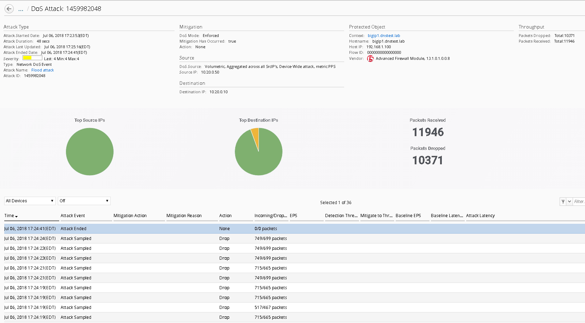
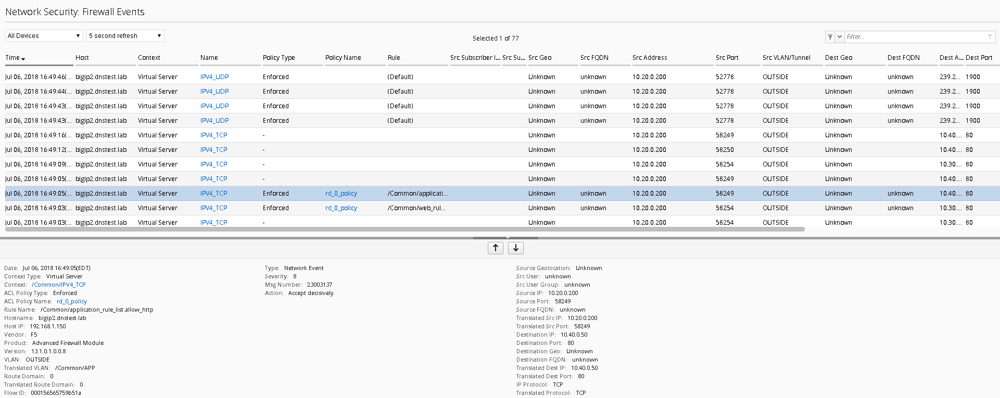

Workflow 2: Configure Network Security and DoS Event Logging 
~~~~~~~~~~~~~~~~~~~~~~~~~~~~~~~~~~~~~~~~~~~~~~~~~~~~~~~~~~~~~

Task 1 – Configure Network Security and DoS Event Logging
^^^^^^^^^^^^^^^^^^^^^^^^^^^^^^^^^^^^^^^^^^^^^^^^^^^^^^^^^

You enable Network Security event logging using the virtual servers
displayed in the context list

#. Navigate to the Configuration Security Network Security Contexts

#. Check the box next to the IPV4_TCP VIP

#. Select “Configure Logging” from the top buttons

   |image119|

#. You will receive a configuration message alerting you to the changes
   about to be made to the device, click Continue

   |image120|

This will now configure a logging profile, associated pools, monitors
and all necessary configuration to send logs to the Data Collection
Device (DCD).

In the spirit of central management, we’re also going to configure the
DoS event logging, so we only must perform one deployment on both
devices.

#. Navigate to Configuration Security Shared Security DoS Protection Device
   DoS Configurations

#. Highlight bigip1.dnstest.lab and click the “Configure DoS Logging”
   button from the top.

   |image121|

#. Once again you will receive a configuration message, click continue

#. Once completed navigate to the Deployments tab

   As most of the configuration is “LTM” related you will first need to
   deploy the LTM configuration.

#. Navigate to Evaluate & Deploy

#. Select Local Traffic & Network Traffic

#. Create an evaluation named “logging_configuration”, leave all other
   defaults and select both devices, once finished, create the evaluation.

   Feel free to examine the changes in the evaluation, when satisfied
   deploy the changes.

#. Once the LTM configuration is deployed, you’ll need to also deploy the
   Network Security portion of the changes.

   Navigate to Deployment Evaluate & Deploy Network Security.

Again, create an evaluation and subsequent deployment for both devices.

Task 2 – Evaluate Network Firewall Events
^^^^^^^^^^^^^^^^^^^^^^^^^^^^^^^^^^^^^^^^^

#. Browse to http://10.30.0.50 once again (or refresh in your tabs).

#. Within BIG-IQ, navigate to Monitoring Network Security Firewall

#. Click on a line item for enriched information in the window below as
   shown

   |image122|

   Feel free to view other logs to see the data presented.

Task 3 – Evaluate DoS Events
^^^^^^^^^^^^^^^^^^^^^^^^^^^^

#. Open a few separate windows to the attack host. We will launch a few
   attacks at once to see the value of consolidated reporting within BIG-IQ
   (there is a text document on the jumbox desktop which contains all of
   the attack commands).

#. Launch a few attacks at once and navigate to Monitoring Events –DoS DoS
   Summary

   |image123|

#. From here you have a consolidated view of all your devices and attacks.

   Click on one of the attack ID’s for enriched information about the
   attack

   |image124|

This concludes the lab. You have had quite the eventful first week at
Initech! You have successfully allowed communication to a new webserver,
you tuned and defended against several DoS attacks, you then configured
BIG-IQ for central device management and monitoring and lastly, you’re
now managing AFM within BIG-IQ. I think you deserve Friday off!!

.. |image123| image:: ../images/image119.png
   :width: 6.49097in
   :height: 2.7in

.. |image119| image:: ../images/image115.png
   :width: 6.49097in
   :height: 2.19097in
.. |image120| image:: ../images/image116.png
   :width: 5.24514in
   :height: 2.43611in
.. |image121| image:: ../images/image117.png
   :width: 6.5in
   :height: 3.25486in
