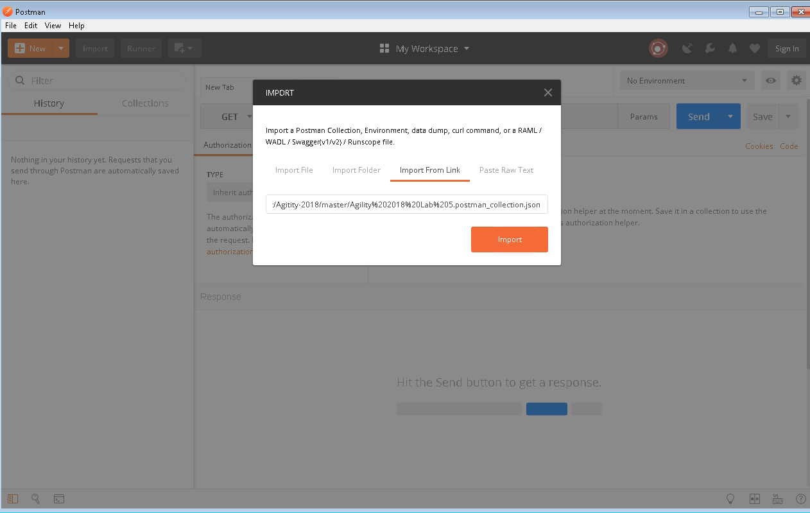
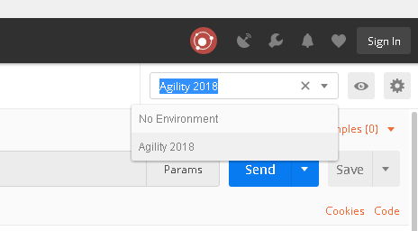
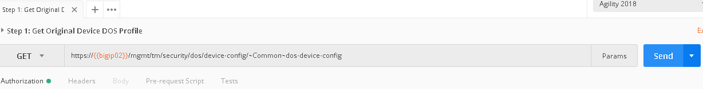
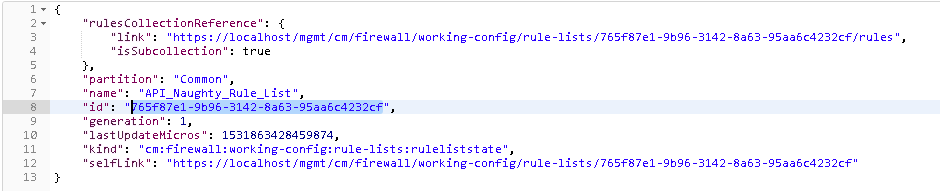
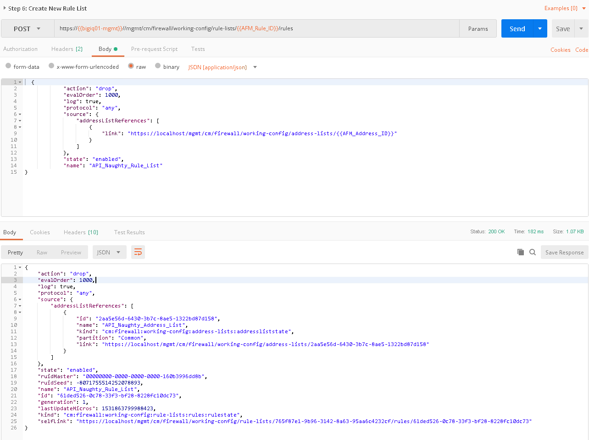
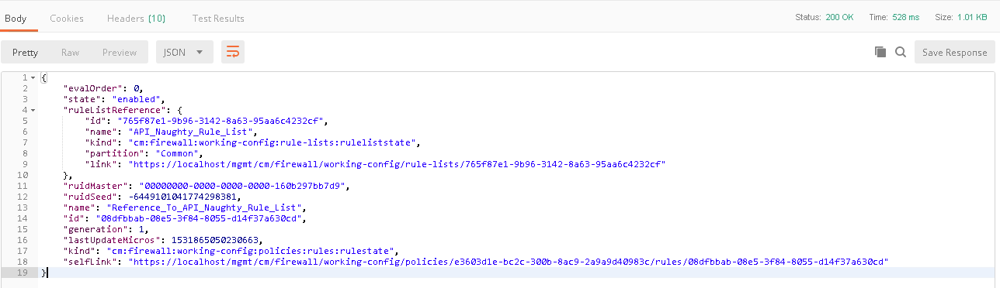
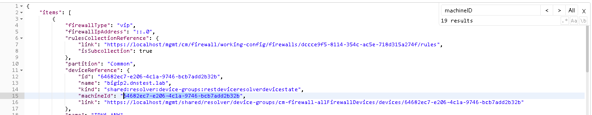
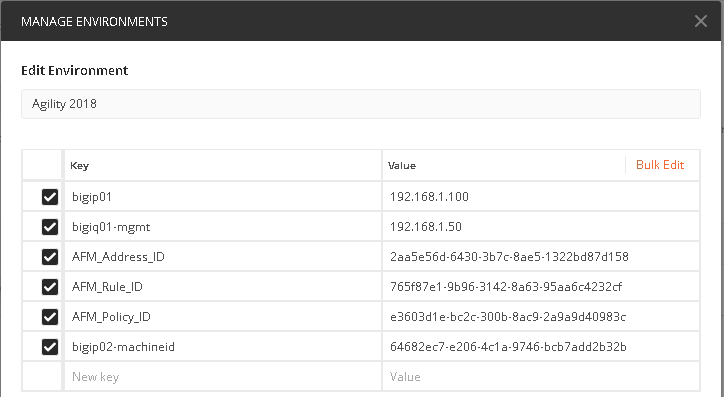
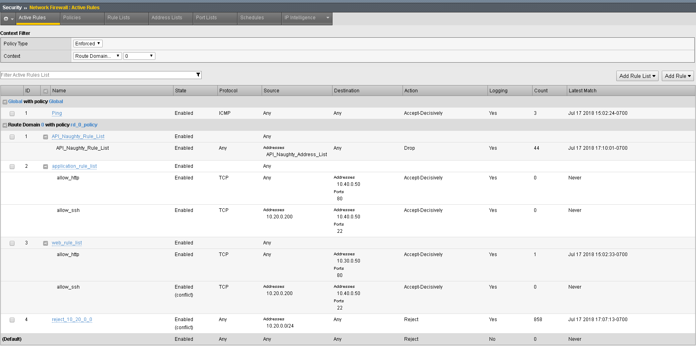

Simulating and defeating a Christmas Tree Packet Attack
=======================================================

Now that we understand what REST is let’s use it to defeat Joanna one
last time. Joanna was feeling festive for her final attack. In this
example, we’ll set the BIG-IP to detect and mitigate Joanna’s attack
where all flags on a TCP packet are set. This is commonly referred to as
a Christmas tree packet and is intended to increase processing on
in-path network devices and end hosts to the target.

To interact with the REST API, we’ll be using POSTMan. We’ll then use
the hping utility to send 25,000 packets to our server, with random
source IPs to simulate a DDoS attack where multiple hosts are attacking
our server. We’ll set the SYN, ACK, FIN, RST, URG, PUSH, Xmas and Ymas
TCP flags.

#. POSTMan is installed as an application and can be accessed from the desktop of the Jumpbox

#. Once you launch POSTMan You’ll then want to import the API calls for the lab as well as the environment variables
   
   - There is a notepad on the desktop labeled “Postman Links”
   - Within POSTman and click on the “Import” link near the top and then select “Import from Link”
   - Copy and paste the **collection** link from within the notepad and select “Import”
   - Copy and paste the **environment** link from within the notepad and select “Import”
   
   |image126|

#. Before proceeding verify the Agility 2018 environment is selected
   from the drop down in the top right of POSTman

   |image127|

#. In the bigip01.dnstest.lab (https://192.168.1.100) web UI, navigate
   to Security > DoS Protection > Device Configuration > Network
   Security.

#. Expand the **Bad-Header-TCP** category in the vectors list.

#. Click on the **Bad TCP Flags (All Flags Set)** vector name and take note of the current settings

#. Within POSTman open the collection “Agility 2018 Lab 5”

   |image128|

#. Run step 1 by clicking on the send button to the right

   |image129|

#. The output from the GET request can be reviewed, this is showing you
   all the device-dos configuration options and settings. Search for
   "bad-tcp-flags-all-set” by clicking ‘ctrl +f’. Note the values as
   they are currently configured. We are now going to modify the Bad
   TCP Flags (All Flags Set) attack vector. To do so run step 2 of the
   collection by highlighting the collection and click “Send”.

#. You can now execute step 3 in the collection and verify the changes,
   you can also verify the changes in the BIG-IP web UI.

   |image130|

#. Open the BIG-IP SSH session and scroll the ltm log in real time with
   the following command: tail -f /var/log/ltm

#. | On the attack host, launch the attack by issuing the following command on the BASH prompt:
   | ``sudo hping3 10.20.0.10 --flood --rand-source --destport 80 -c 25000 --syn --ack --fin --rst --push --urg --xmas --ymas``

#. | You’ll see the BIG-IP ltm log show that the attack has been detected:
   | |image131|

#. | After approximately 60 seconds, press **CTRL+C** to stop the attack.
   | |image132|

#. Navigate to **Security** > **DoS Protection**> **DoS Overview (you
   may need to refresh or set the auto refresh to 10 seconds).** You’ll
   notice from here you can see all the details of the active attacks.
   You can also modify an attack vector right from this screen by
   clicking on the attack vector and modifying the fly out.

   |image133|

#. | Return to the BIG-IP web UI. Navigate to **Security** > **Event Logs** > **DoS** > **Network** > **Events**. Observe the log entries showing the details surrounding the attack detection and mitigation.
   | |image134|

#. Navigate to **Security** > **Reporting** > **DoS** > **Analysis**.
   Single-click on the attack ID in the filter list to the right of the
   charts and observe the various statistics around the attack.

#. The same attacks can also be seen in BIG-IQ as demonstrated in the previous lab.

**Congratulations, you have successfully defeated Joanna’s festive attack using only the REST API to configure the device!**

Since it’s the end of the week and Joanna is using the same IP address continually, lets block
her IP address and her subnet using BIG-IQ. We’ll use the REST API to
accomplish this as well, as BIG-IQ also has an available REST API.

#. Using POSTman run step 4, this will create an address-list within
   BIG-IQ, the advantage to address-lists is they allow you to group
   similar objects into a group. In this instance we’re going to create
   an address-list named API_Naughty_Address_List with a host and a
   network. Once you run the command you’ll receive output below. You
   will need to copy the value returned in the ‘ID” field as shown
   below:

   |image135|

#. Take the copied text and paste it into the environment variable for
   AFM_Adddress_ID. The variables are accessed by clicking on the “eye”
   icon next to where you selected the Agility 2018 Environment:

   |image136|

#. Click edit and enter the value returned in step 1, when completed
   click update

   |image137|

#. We will now create a rule list name first, to accomplish this send
   the call found in step 5. You will need to also capture the “ID” in
   this step as well. This value will be updated in the AFM_Rule_ID
   field

   |image138|

#. Take the copied text and paste it into the environment variable for
   AFM_Rule_ID

   |image139|

#. At this stage we have created an address-list with objects and saved
   the ID, we have also created a rule name and saved the ID. The next
   step is to add an actual rule to the newly created rule named
   “Naughty_Rule_List”. Before you send the call-in step 6, take a
   moment to examine the body of the request. You’ll notice in the URI
   we’re referencing the variable of AFM_Rule_ID and in the body of the
   JSON request we’re linking the AFM_Address_ID to the rule. Once sent
   you’ll receive confirmation similar to the below output.

   |image140|

#. Since this is an existing environment, we’re going to first need to
   obtain the policy ID before we can assign the value to this variable.
   To obtain the policy ID of the existing policy we created in lab 1
   and imported in the prior lab, run step 7.

   |image141|

#. You will notice there are two policies, Global and rd_0_policy, we’ll
   need to copy the ID for the rd_0_policy which is located directly
   under its name and paste it into the variable for AFM_Policy_ID.

   |image142|

#. Finally run step 8 to add the new rule list to the existing policy,
   when completed you’ll receive output similar as seen below.

   |image143|

#. Before we deploy the policy. Log into the BIG-IQ web UI
   (https://192.168.1.50) and navigate to Configuration Security
   Network Security Firewall Policies. Click on the link for the
   rd_0_policy, expand all the rules to verify your new API created
   rule list is first in the list and all objects are created as
   expected.

   |image144|

#. The final step is to deploy the policy to the BIG-IP. Before we can
   do this, we have one last variable we’ll need to acquire, the
   machine ID of bigip02.dnslab.test. To obtain the machine ID run the
   call in step 9, once the call is run, you will look for the
   machineId key and copy the value to the environment variable
   bigip02-machined as shown below and click update.

   |image145|

   |image146|

#. Finally, you will run step 10, this will initiate a deployment on
   BIG-IQ to deploy the changes to BIG-IP. Within BIG-IQ navigate to
   Deployment Evaluate & Deploy Network Security. At the bottom in the
   deployments section you’ll notice an API Policy Deploy task. Feel
   free to click on the task to investigate the changes. Once the
   policy has deployed, log into the web UI of bigip02.dnstest.lab and
   navigate to Security network Firewall Active Rules. Change the
   context to Route Domain and select 0. Expand all of the rules to
   verify the rules have been deployed as expected. Your final screen
   should look something like the screen capture below.

   |image147|

Lastly, in your web browser, verify you can no longer access the web
pages http://10.30.0.50 and http://10.40.0.50 as well as no longer being
able to SSH to any of the devices.

.. |image128| image:: ../images/image123.png
   :width: 2.50278in
   :height: 4.31042in

.. |image130| image:: ../images/image78.png
   :width: 2.43392in
   :height: 2.49669in
.. |image131| image:: ../images/image79.png
   :width: 4.48611in
   :height: 0.38889in
.. |image132| image:: ../images/image80.png
   :width: 4.43056in
   :height: 0.97222in
.. |image133| image:: ../images/image81.png
   :width: 6.49097in
   :height: 1.10208in
.. |image134| image:: ../images/image82.png
   :width: 5in
   :height: 1.70833in
.. |image135| image:: ../images/image125.png
   :width: 6.49097in
   :height: 1.82708in
.. |image136| image:: ../images/image126.png
   :width: 3.81806in
   :height: 3.66389in
.. |image137| image:: ../images/image127.png
   :width: 5.99097in
   :height: 6.22708in

.. |image139| image:: ../images/image129.png
   :width: 5.98194in
   :height: 6.18194in

.. |image141| image:: ../images/image131.png
   :width: 6.49097in
   :height: 3.15486in
.. |image142| image:: ../images/image132.png
   :width: 6in
   :height: 3.33333in

.. |image144| image:: ../images/image134.png
   :width: 6.5in
   :height: 1.69097in

