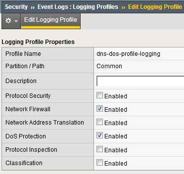
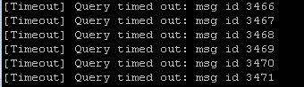
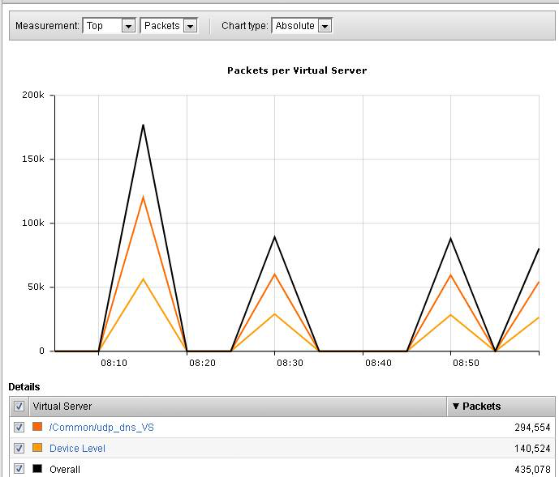
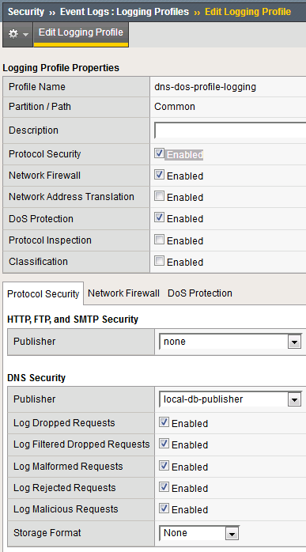

Base BIG-IP Configuration
-------------------------

In this lab, the VE has been configured with the basic system settings
and the VLAN/self-IP configurations required for the BIG-IP to
communicate and pass traffic on the network. We’ll now need to configure
the BIG-IP to listen for traffic and pass it to the back end server.

1.  Launch the Firefox shortcut titled **Launch BIG-IP Web UI** on the
    desktop of your lab jump server. The credentials for the BIG-IP are
    conveniently displayed in the login banner. Just in case: **admin /
    401elliottW!**

2.  Navigate to **Local Traffic** > **Nodes** and create a new node with
    the following settings, leaving unspecified fields at their default
    value:

    a. Name: lab-server-10.10.0.50
    b. | Address: 10.10.0.50
       | |image4|

3.  Click **Finished** to add the new node.

4.  Navigate to **Local Traffic** > **Pools** and create a new pool with
    the following settings, leaving unspecified attributes at their
    default value:

    a. Name: lab-server-pool
    b. Health Monitors: gateway\_icmp
    c. New Members: Node List
       - Address: lab-server-10.10.0.50
       - Service Port: \* (All Ports)
    d. | Click **Add** to add the new member to the member list.
       | |image5|

5.  Click **Finished** to create the new pool.

6.  Because the attack server will be sending a huge amount of traffic,
    we’ll need a fairly large SNAT pool. Navigate to **Local Traffic** >
    **Address Translation** > **SNAT Pool List** and create a new SNAT
    pool with the following attributes:

    a. Name: inside\_snat\_pool

    b. | Member List: 10.10.0.125, 10.10.0.126, 10.10.0.127, 10.10.0.128, 10.10.0.129, 10.10.0.130 
       | |image6|

7.  Click **Finished** to commit your changes.

8.  Navigate to **Local Traffic** > **Virtual Servers** and create a new
    virtual server with the following settings, leaving unspecified
    fields at their default value:

    a. Name: udp\_dns\_VS
    b. Destination Address/Mask: 10.20.0.10
    c. Service Port: 53
    d. Protocol: UDP
    e. Source Address Translation: SNAT
    f. SNAT Pool: inside\_snat\_pool
    g. | Default Pool: lab-server-pool
       | |image7|

9.  Click **Finished**.

10. We’ll now test the new DNS virtual server. SSH into the attack host
    by clicking the “Attack Host (Ubuntu)” icon on the jump host
    desktop.

11. Issue the dig @10.20.0.10
    `www.example.com <http://www.example.com>`__ +short command on the
    BASH CLI of the attack host. You should see output similar to:
    
    |image8|
    
    This verifies that DNS traffic is passing through the
    BIG-IP.

12. Return to the BIG-IP and navigate to **Local Traffic** > **Virtual
    Servers** and create a new virtual server with the following
    settings, leaving unspecified fields at their default value:

    a. Name: other\_protocols\_VS
    b. Destination Address/Mask: 10.20.0.10
    c. Service Port: \* (All Ports)
    d. Protocol: \* All Protocols
    e. Any IP Profile: ipother
    f. Source Address Translation: SNAT
    g. SNAT Pool: inside\_snat\_pool
    h. | Default Pool: lab-server-pool 
       | |image9|

13. Return to the Attack Host SSH session and attempt to SSH to the
    server using SSH 10.20.0.10. Simply verify that you are prompted for
    credentials and press CTRL+C to cancel the session. This verifies
    that non-DNS traffic is now flowing through the BIG-IP.
    
Detecting and Preventing DNS DoS Attacks on a Virtual Server
------------------------------------------------------------

Establishing a DNS server baseline
~~~~~~~~~~~~~~~~~~~~~~~~~~~~~~~~~~

Before we can attack our DNS server, we should establish a baseline for
how many QPS our DNS server can handle. For this lab, let’s find the
magic number of QPS that causes 50% CPU utilization on the BIND process.

1. Connect to the Victim Server SSH session by double-clicking the
   **Victim Server (Ubuntu)** shortcut on the jump host desktop.

2. From the BASH prompt, enter **top** and press **Enter** to start the
   top utility.

3. You will see a list of running processes sorted by CPU utilization,
   like the output below:

   |image10|

4. Connect to the Attack Host SSH session by double-clicking the
   **Attack Host (Ubuntu)** shortcut on the jump host desktop.

5. | Start by sending 500 DNS QPS for 30 seconds to the host using the
     following syntax:
   | dnsperf -s 10.20.0.10 -d queryfile-example-current -c 20 -T 20 -l
     30 -q 10000 -Q 500
     
.. HINT:: There is a text file on the desktop of the jump host with all of the CLI commands used in the lab for cut/paste use.

6. Observe CPU utilization over the 30 second window for the **named**
   process. If the CPU utilization is below 45%, increase the QPS by
   increasing the -Q value. If the CPU utilization is above 55%,
   decrease the QPS.

7. Record the QPS required to achieve a sustained CPU utilization of
   approximately 50%. Consider this the QPS that the server can safely
   sustain for demonstration purposes.

8. | Now, attack the DNS server with 10,000 QPS using the following
     syntax:
   | dnsperf -s 10.20.0.10 -d queryfile-example-current -c 20 -T 20 -l
     30 -q 10000 -Q 10000

9. You’ll notice that the CPU utilization on the victim server
   skyrockets, as well as DNS query timeout errors appearing on the
   attack server’s SSH session. This shows your DNS server is
   overwhelmed.

Configuring a DoS Logging Profile
~~~~~~~~~~~~~~~~~~~~~~~~~~~~~~~~~

We’ll create a DoS logging profile so that we can see event logs in the
BIG-IP UI during attack mitigation.

1. On the BIG-IP web UI, navigate to **Security** > **Event Logs** >
   **Logging Profiles** and create a new profile with the following
   values, leaving unspecified attributes at their default value:

   a. Profile Name: dns-dos-profile-logging

   b. DoS Protection: Enabled

   c. | DNS DoS Protection Publisher: local-db-publisher
      | |image11|

Configuring a DoS Profile
~~~~~~~~~~~~~~~~~~~~~~~~~

We’ll now create a DoS profile with manually configured thresholds to
limit the attack’s effect on our server.

1. | Navigate to **Security** > **DoS Protection** > **DoS Profiles**
     and create a new DoS profile with the name **dns-dos-profile**.
   | |image12|

2. The UI will return to the DoS Profiles list. Click the
   **dns-dos-profile** name.

3. Click the **Protocol Security** tab and select **DNS Security** from
   the drop-down.

4. Click the **DNS A Query** vector from the Attack Type list.

5. Modify the **DNS A Query** vector configuration to match the
   following values, leaving unspecified attributes with their default
   value:

   a. State: Mitigate

   b. Threshold Mode: Fully Manual

   c. Detection Threshold EPS: (Set this at 80% of your safe QPS value)

   d. | Mitigation Threshold EPS: (Set this to your safe QPS value)
      | |image13|

6. Make sure that you click **Update** to save your changes.

Attaching a DoS Profile
~~~~~~~~~~~~~~~~~~~~~~~

We’ll attach the DoS profile to the virtual server that we configured to
manage DNS traffic.

1. Navigate to **Local Traffic** > **Virtual Servers** > **Virtual
   Server List**.

2. Click on the **udp\_dns\_VS** name.

3. Click on the **Security** tab and select **Policies**.

4. In the **DoS Protection Profile** field, select **Enabled** and
   choose the **dns-dos-profile**.

5. In the **Log Profile**, select **Enabled** and move the
   **dns-dos-profile-logging** profile from **Available** to
   **Selected**.

6. Click **Update**.

Simulate a DNS DDoS Attack
~~~~~~~~~~~~~~~~~~~~~~~~~~

1. Open the SSH session to the victim server and ensure the top utility
   is running.

2. | Once again, attack your DNS server from the attack host using the
     following syntax:
   | dnsperf -s 10.20.0.10 -d queryfile-example-current -c 20 -T 20 -l
     30 -q 10000 -Q 10000

3. On the server SSH session running the top utility, notice the CPU
   utilization on your server remains in a range that ensures the DNS
   server is not overwhelmed.

4. | After the attack, navigate to **Security** > **Event Logs** >
     **DoS** > **DNS Protocol**. Observe the logs to see the mitigation
     actions taken by the BIG-IP.
   | |image14|

DNS DDoS Mitigations for Continued Service
~~~~~~~~~~~~~~~~~~~~~~~~~~~~~~~~~~~~~~~~~~

At this point, you’ve successfully configured the BIG-IP to limit the
amount of resource utilization on the BIG-IP. Unfortunately, even valid
DNS requests can be caught in the mitigation we’ve configured. There are
further steps that can be taken to mitigate the attack that will allow
non-malicious DNS queries.

Bad Actor Detection
^^^^^^^^^^^^^^^^^^^

Bad actor detection and blacklisting allows us to completely block
communications from malicious hosts at the BIG-IP, completely preventing
those hosts from reaching the back-end servers. To demonstrate:

1.  Navigate to **Security** > **DoS Protection** > **DoS Profiles**.

2.  Click on the **dns-dos-profile** profile name.

3.  Click on the **Protocol Security** tab then select **DNS Security**.

4.  Click on the **DNS A Query** attack type name.

5.  Modify the vector as follows:

    a. Bad Actor Detection: Checked

    b. Per Source IP Detection Threshold EPS: 80

    c. Per Source IP Mitigation Threshold EPS: 100

    d. Add Source Address to Category: Checked

    e. Category Name: denial\_of\_service

    f. Sustained Attack Detection Time: 15 seconds

    g. | Category Duration Time: 60 seconds
       | |image15|

6.  Make sure you click **Update** to save your changes.

7.  Navigate to **Security** > **Network Firewall** > **IP
    Intelligence** > **Policies** and create a new IP Intelligence
    policy with the following values, leaving unspecified attributes at
    their default values:

    a. Name: dns-bad-actor-blocking

    b. Default Log Actions section:

       i. Log Blacklist Category Matches: Yes

    c. Blacklist Matching Policy

       i. Create a new blacklist matching policy:

          1. | Blacklist Category: denial\_of\_service
             | |image16|

          2. Click **Add** to add the policy.

8.  Click **Finished**.

9.  Navigate to **Local Traffic** > **Virtual Servers** > **Virtual
    Server List**.

10. Click on the **udp\_dns\_VS** virtual server name.

11. Click on the **Security** tab and select **Policies**.

12. | Enable **IP Intelligence** and choose the
      **dns-bad-actor-blocking** policy.
    | |image17|

13. Make sure you click **Update** to save your changes.

14. Navigate to **Security** > **Event Logs** > **Logging Profiles**.

15. Click the **global-network** logging profile name.

16. | Under the **Network Firewall** tab, set the IP Intelligence
      Publisher to **local-db-publisher** and check **Log Shun Events**.
    | |image18|

17. Click **Update** to save your changes.

18. Click the **dns-dos-profile-logging** logging profile name.

19. | Check **Enabled** next to **Network Firewall**.
    | |image19|

20. | Under the **Network Firewall** tab, change the **Network
      Firewall** and **IP Intelligence Publisher** to
      **local-db-publisher** and click **Update**.
    | |image20|

21. Bring into view the Victim Server SSH session running the top
    utility to monitor CPU utilization.

22. | On the Attack Server host, launch the DNS attack once again using
      the following syntax:
    | dnsperf -s 10.20.0.10 -d queryfile-example-current -c 20 -T 20 -l
      30 -q 10000 -Q 10000

23. | You’ll notice CPU utilization on the victim server begin to climb,
      but slowly drop. The attack host will show that queries are timing
      out as shown below. This is due to the BIG-IP blacklisting the bad
      actor.
    | |image21|

24. Navigate to **Security** > **Event Logs** > **Network** > **IP
    Intelligence**. Observe the bad actor blocking mitigation logs.

25. | Navigate to **Security** > **Event Logs** > **Network** >
      **Shun**. This screen shows the bad actor being added to (and
      later deleted from) the shun category.
    | |image22|

26. | Navigate to **Security** > **Reporting** > **Protocol** > **DNS**.
      Change the **View By** drop-down to view various statistics around
      the DNS traffic and attacks.
    | |image23|

27. Navigate to **Security** > **Reporting** > **Network** > **IP
    Intelligence**. The default view may be blank. Change the **View
    By** drop-down to view various statistics around the IP Intelligence
    handling of the attack traffic.

28. | Navigate to **Security** > **Reporting** > **DoS** > **Dashboard**
      to view an overview of the DoS attacks and timeline. You can
      select filters in the filter pane to highlight specific attacks.
    | |image24|

29. Finally, navigate to **Security** > **Reporting** > **DoS** >
    **Analysis**. View detailed statistics around each attack.

Remote Triggered Black Holing
^^^^^^^^^^^^^^^^^^^^^^^^^^^^^

The BIG-IP supports the advertisement of bad actor(s) to upstream
devices via BGP to block malicious traffic closer to the source. This is
accomplished by publishing a blacklist to an external resource. This is
not demonstrated in this lab.

Silverline Mitigation
^^^^^^^^^^^^^^^^^^^^^

F5's cloud-based scrubbing service Silverline offers “always on” and “on demand” DDoS scrubbing that could
assist in this scenario as well. This is not demonstrated in this lab.

Filtering specific DNS operations
---------------------------------

The BIG-IP offers the ability to filter DNS query types and header
opcodes to act as a DNS firewall. To demonstrate, we will block MX
queries from our DNS server.

1.  Open the SSH session to the attack host.

2.  | Perform an MX record lookup by issuing the following command:
    | dig @10.20.0.10 MX example.com

3.  The server doesn’t have a record for this domain. This server
    doesn’t have MX records, so those requests should be filtered

4.  Navigate to **Security** > **Protocol Security** > **Security
    Profiles** > **DNS** and create a new DNS security profile with the
    following values, leaving unspecified attributes at their default
    value:

    a. Name: dns-block-mx-query

    b. | Query Type Filter: move mx from Available to Active
       | |image25|

5.  Navigate to **Local Traffic** > **Profiles** > **Services** >
    **DNS**. **NOTE:** if you are mousing over the services, DNS may not
    show up on the list. Select **Services** and then use the pulldown
    menu on services to select **DNS**.

6.  Create a new DNS services profile with the following values, leaving
    unspecified values at their default values:

    a. Name: dns-block-mx

    b. DNS Traffic

       i.  DNS Security: Enabled

       ii. | DNS Security Profile Name: dns-block-mx-query
           | |image26|

7.  Navigate to **Local Traffic** > **Virtual Servers** > **Virtual
    Server List**.

8.  Click on the **udp\_dns\_VS** virtual server name.

9.  In the **Configuration** section, change the view to **Advanced**.

10. | Set the **DNS Profile** to **dns-block-mx**.
    | |image27|

11. Click **Update** to save your settings.

12. Navigate to **Security** > **Event Logs** > **Logging Profiles**.

13. Click on the **dns-dos-profile-logging** logging profile name.

14. Check **Enabled** next to **Protocol Security**.

15. | In the **Protocol Security** tab, set the **DNS Security
      Publisher** to *local-db-publisher* and check all five of the
      request log types.
    | |image28|

16. Make sure that you click **Update** to save your settings.

17. | Return to the Attack Server SSH session and re-issue the MX query
      command:
    | dig @10.20.0.10 MX example.com

18. The query hangs as the BIG-IP is blocking the MX lookup.

19. | Navigate to **Security** > **Event Logs** > **Protocol** >
      **DNS**. Observer the MX query drops.
    | |image29|

.. ATTENTION:: This concludes the DNS portion of the lab. On the victim server, stop the top utility by pressing **CTRL + C**.
    
.. |image4| image:: _images/image6.png
   :width: 3.94702in
   :height: 3.80739in
.. |image5| image:: _images/image7.png
   :width: 4.75828in
   :height: 4.42937in
.. |image6| image:: _images/image8.png
   :width: 4.72535in
   :height: 3.47384in
.. |image7| image:: _images/image9.png
   :width: 3.80731in
   :height: 8.22517in
.. |image8| image:: _images/image10.png
   :width: 6.16667in
   :height: 0.44444in
.. |image9| image:: _images/image11.png
   :width: 4.73472in
   :height: 6.05700in
.. |image10| image:: _images/image12.png
   :width: 5.60000in
   :height: 3.53333in
.. |image11| image:: _images/image13.png
   :width: 4.04500in
   :height: 5.58775in
.. |image12| image:: _images/image14.png
   :width: 4.94444in
   :height: 2.29167in
.. |image13| image:: _images/image15.png
   :width: 3.54305in
   :height: 4.68726in
.. |image14| image:: _images/image16.png
   :width: 6.50000in
   :height: 2.78542in
.. |image15| image:: _images/image17.png
   :width: 2.67129in
   :height: 5.81457in
.. |image16| image:: _images/image18.png
   :width: 6.22083in
   :height: 3.67500in
.. |image17| image:: _images/image19.png
   :width: 3.81074in
   :height: 5.31788in
.. |image18| image:: _images/image20.png
   :width: 4.17881in
   :height: 2.18072in

.. |image20| image:: _images/image22.png
   :width: 3.15278in
   :height: 3.98611in

.. |image22| image:: _images/image24.png
   :width: 4.87500in
   :height: 1.68056in

.. |image24| image:: _images/image26.png
   :width: 5.00000in
   :height: 4.06944in
.. |image25| image:: _images/image27.png
   :width: 3.89968in
   :height: 3.43639in
.. |image26| image:: _images/image28.png
   :width: 2.60017in
   :height: 6.93378in
.. |image27| image:: _images/image29.png
   :width: 3.02244in
   :height: 2.63576in

.. |image29| image:: _images/image31.png
   :width: 3.80132in
   :height: 1.11928in