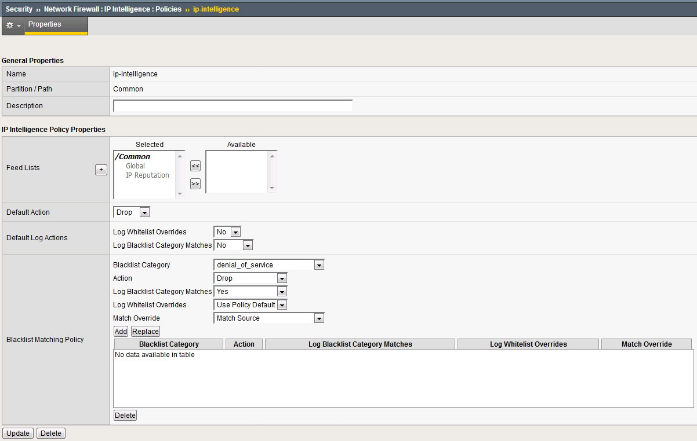

Detecting and Preventing System DoS and DDoS Attacks
----------------------------------------------------

Configure Logging
~~~~~~~~~~~~~~~~~

Configuring a logging destination will allow you to verify the BIG-IPs
detection and mitigation of attacks, in addition to the built-in
reporting.

1. In the BIG-IP web UI, navigate to **Security** > **DoS Protection** >
   **Device Configuration** > **Properties**.

2. Under **Log Pubisher**, select **local-db-publisher**.

3. | Click the **Commit Changes to System** button.
   | |image30|

Simulating a Christmas Tree Packet Attack
~~~~~~~~~~~~~~~~~~~~~~~~~~~~~~~~~~~~~~~~~

In this example, we’ll set the BIG-IP to detect and mitigate an attack
where all flags on a TCP packet are set. This is commonly referred to as
a Christmas tree packet and is intended to increase processing on
in-path network devices and end hosts to the target.

We’ll use the hping utility to send 25,000 packets to our server, with
random source IPs to simulate a DDoS attack where multiple hosts are
attacking our server. We’ll set the SYN, ACK, FIN, RST, URG, PUSH, Xmas
and Ymas TCP flags.

1.  In the BIG-IP web UI, navigate to **Security** > **DoS Protection**
    > **Device Configuration** > **Network Security**.

2.  Expand the **Bad-Header-TCP** category in the vectors list.

3.  Click on the **Bad TCP Flags (All Flags Set)** vector name.

4.  Configure the vector with the following parameters:

    a. State: Mitigate

    b. Threshold Mode: Fully Manual

    c. Detection Threshold EPS: Specify 50

    d. Detection Threshold Percent: Specify 200

    e. | Mitigation Threshold EPS: Specify 100
       | |image31|

5.  Click **Update** to save your changes.

6.  Open the BIG-IP SSH session and scroll the ltm log in real time with
    the following command: tail -f /var/log/ltm

7.  | On the attack host, launch the attack by issuing the following
      command on the BASH prompt:
    | sudo hping3 10.20.0.10 --flood --rand-source --destport 80 -c
      25000 --syn --ack --fin --rst --push --urg --xmas --ymas
      
8.  | You’ll see the BIG-IP ltm log show that the attack has been
      detected:
    | |image32|

9.  | After approximately 60 seconds, press **CTRL+C** to stop the
      attack.
    | |image33|

10. | Return to the BIG-IP web UI. Navigate to **Security** > **Event
      Logs** > **DoS** > **Network** > **Events**. Observer the log
      entries showing the details surrounding the attack detection and
      mitigation.
    | |image34|

11. Navigate to **Security** > **Reporting** > **DoS** > **Analysis**.
    Single-click on the attack ID in the filter list to the right of the
    charts and observe the various statistics around the attack.

Simulating a TCP SYN DDoS Attack
~~~~~~~~~~~~~~~~~~~~~~~~~~~~~~~~

In the last example, we crafted a packet that is easily identified as
malicious, as its invalid. We’ll now simulate an attack with traffic
that could be normal, acceptable traffic. The TCP SYN flood attack will
attempt to DDoS a host by sending valid TCP traffic to a host from
multiple source hosts.

1.  In the BIG-IP web UI, navigate to **Security** > **DoS Protection**
    > **Device** **Configuration** > **Network Security**.

2.  Expand the **Flood** category in the vectors list.

3.  Click on **TCP Syn Flood** vector name.

4.  Configure the vector with the following parameters (use the lower values specified):

    a. State: Mitigate

    b. Threshold Mode: Fully Manual

    c. Detection Threshold EPS: 50

    d. Detection Threshold Percent: 200

    e. | Mitigation Threshold EPS: 100
       | |image35|

5.  Click **Update** to save your changes.

6.  Open the BIG-IP SSH session and scroll the ltm log in real time with
    the following command: tail -f /var/log/ltm

7.  | On the attack host, launch the attack by issuing the following
      command on the BASH prompt:
    | sudo hping3 10.20.0.10 --flood --rand-source --destport 80 --syn
      -d 120 -w 64

8.  After about 60 seconds, stop the flood attack by pressing **CTRL +
    C**.

9.  Return to the BIG-IP web UI and navigate to **Security** > **Event
    Logs** > **DoS** > **Network** > **Events**. Observe the log entries
    showing the details surrounding the attack detection and mitigation.

10. Navigate to **Security** > **Reporting** > **DoS** > **Dashboard**
    to view an overview of the DoS attacks and timeline. You can select
    filters in the filter pane to highlight the specific attack.

11. Finally, navigate to **Security** > **Reporting** > **DoS** >
    **Analysis**. View detailed statistics around the attack.

Preventing Global DoS Sweep and Flood Attacks
---------------------------------------------

In the last section, the focus was on attacks originating from various
hosts. In this section, we will focus on mitigating flood and sweep
attacks from a single host.

Single Endpoint Sweep
~~~~~~~~~~~~~~~~~~~~~

The single endpoint sweep is an attempt for an attacker to send traffic
across a range of ports on the target server, typically to scan for open
ports.

1.  In the BIG-IP web UI, navigate to **Security** > **DoS Protection**
    > **Device Configuration** > **Network Security**.

2.  Expand the **Single-Endpoint** category in the vectors list.

3.  Click on **Single Endpoint Sweep** vector name.

4.  Configure the vector with the following parameters:

    a. State: Mitigate

    b. Threshold Mode: Fully Manual

    c. Detection Threshold EPS: 150

    d. Mitigation Threshold EPS: 200

    e. Add Source Address to Category: Checked

    f. Category Name: denial\_of\_service

    g. Sustained Attack Detection Time: 10 seconds

    h. Category Duration Time: 60 seconds

    i. | Packet Type: Move All IPv4 to Selected
       | |image36|

5.  Click **Update** to save your changes.

6.  Navigate to **Security** > **Network Firewall** > **IP
    Intelligence** > **Policies**.

7.  | In the **Global Policy** section, change the **IP Intelligence
      Policy** to **ip-intelligence**.
    | |image37|

8.  Click **Update**.

9.  Click on the **ip-intelligence** policy in the policy list below.

10. Create a new Blacklist Matching Policy in the IP Intelligence Policy
    Properties section with the following attributes, leaving
    unspecified attributes with their default values:

    a. Blacklist Category: denial-of-service

    b. Action: drop

    c. Log Blacklist Category Matches: Yes

11. | Click **Add** to add the new Blacklist Matching Policy.
    | |image38|

12. Click **Update** to save changes to the ip-intelligence policy.

13. Open the BIG-IP SSH session and scroll the ltm log in real time with
    the following command: tail -f /var/log/ltm

14. On the victim server, start a packet capture with an SSH filter by
    issuing sudo tcpdump -nn not port 22

15. | On the attack host, launch the attack by issuing the following
      command on the BASH prompt:
    | sudo hping3 10.20.0.10 --flood --scan 1-65535 -d 128 -w 64 --syn
    
16. You will see the scan find a few open ports on the server, and the
    server will show the inbound sweep traffic. However, you will notice
    that the traffic to the server stops after a short time (10 seconds,
    the configured sustained attack detection time.) Leave the test
    running.

17. After approximately 60 seconds, sweep traffic will return to the
    host. This is because the IP Intelligence categorization of the
    attack host has expired. After 10 seconds of traffic, the bad actor
    is again blacklisted for another 60 seconds.

18. Stop the sweep attack on the attack host by pressing **CTRL + C**.

19. Return to the BIG-IP web UI and navigate to **Security** > **Event
    Logs** > **DoS** > **Network** > **Events**. Observe the log entries
    showing the details surrounding the attack detection and mitigation.

20. Navigate to **Security** > **Event Logs** > **Network** > **IP
    Intelligence**. Observe the log entries showing the mitigation of
    the sweep attack via the ip-intelligence policy.

21. Navigate to **Security** > **Event Logs** > **Network** > **Shun**.
    Observe the log entries showing the blacklist adds and deletes.

22. Navigate to **Security** > **Reporting** > **Network** > **IP
    Intelligence**. Observe the statistics showing the sweep attack and
    mitigation. Change the **View By** drop-down to view the varying
    statistics.

23. Navigate to **Security** > **Reporting** > **DoS** > **Dashboard**
    to view an overview of the DoS attacks and timeline. You can select
    filters in the filter pane to highlight the specific attack.

24. Finally, navigate to **Security** > **Reporting** > **DoS** >
    **Analysis**. View detailed statistics around the attack.

Single Endpoint Flood
~~~~~~~~~~~~~~~~~~~~~

The single endpoint flood attack is an attempt for an attacker to send a
flood of traffic to a host in hopes of overwhelming a service to a point
of failure. In this example, we’ll flood the target server with ICMP
packets.

1.  In the BIG-IP web UI, navigate to **Security** > **DoS Protection**
    > **Device Configuration** > **Network Security**.

2.  Expand the **Single-Endpoint** category in the vectors list.

3.  Click on **Single Endpoint Flood** vector name.

4.  Configure the vector with the following parameters:

    a. State: Mitigate

    b. Threshold Mode: Fully Manual

    c. Detection Threshold EPS: 150

    d. Mitigation Threshold EPS: 200

    e. Add Destination Address to Category: Checked

    f. Category Name: denial\_of\_service

    g. Sustained Attack Detection Time: 10 seconds

    h. Category Duration Time: 60 seconds

    i. | Packet Type: Move Any ICMP (IPv4) to Selected
       | |image39|

5.  Click **Update** to save your changes.

6.  Open the BIG-IP SSH session and scroll the ltm log in real time with
    the following command: tail -f /var/log/ltm

7.  We’ll run a packet capture on the victim server to gauge the
    incoming traffic. On the victim server, issue the following command:
    sudo tcpdump -nn not port 22

8.  | On the attack host, launch the attack by issuing the following
      command on the BASH prompt:
    | sudo hping3 10.20.0.10 --faster -c 25000 --icmp

9.  The attack host will begin flooding the victim server with ICMP
    packets. However, you will notice that the traffic to the server
    stops after a short time (10 seconds, the configured sustained
    attack detection time.)

10. After approximately 60 seconds, run the attack again. ICMP traffic
    will return to the host. This is because the IP Intelligence
    categorization of the attack host has expired.

11. Return to the BIG-IP web UI.

12. Navigate to **Security** > **Event Logs** > **DoS** > **Network** >
    **Events**. Observe the log entries showing the details surrounding
    the attack detection and mitigation.

13. Navigate to **Security** > **Event Logs** > **Network** > **IP
    Intelligence**. Observe the log entries showing the mitigation of
    the sweep attack via the ip-intelligence policy.

14. Navigate to **Security** > **Reporting** > **Network** > **IP Intelligence**. Observe the statistics showing the sweep attack and mitigation.

15. Navigate to **Security** > **Reporting** > **DoS** > **Dashboard** to view an overview of the DoS attacks and timeline. You can select filters in the filter pane to highlight the specific attack.

16. Finally, navigate to **Security** > **Reporting** > **DoS** > **Analysis**. View detailed statistics around the attack.

Conclusion
----------

Congratulations on finishing the lab!

This lab did not cover auto thresholds for protections, nor did we test dynamic signatures. Testing auto thresholds requires a more real-world environment. For suggested testing guidelines for auto thresholds and dynamic signatures, engage your F5 account team.

This concludes the DoS/DDoS portion of the lab. You may now close all sessions, log out of the jump host and log out of the training portal.

Thank you for your time.

.. |image30| image:: ../images/image32.png
   :width: 2.98013in
   :height: 1.62914in
.. |image31| image:: ../images/image33.png
   :width: 2.43392in
   :height: 2.49669in
.. |image32| image:: ../images/image34.png
   :width: 4.48611in
   :height: 0.38889in
.. |image33| image:: ../images/image35.png
   :width: 4.43056in
   :height: 0.97222in
.. |image34| image:: ../images/image36.png
   :width: 5.00000in
   :height: 1.70833in
.. |image35| image:: ../images/image37.png
   :width: 2.45542in
   :height: 3.49669in
.. |image36| image:: ../images/image38.png
   :width: 2.79540in
   :height: 6.25166in
.. |image37| image:: ../images/image39.png
   :width: 2.56954in
   :height: 0.91286in

.. |image39| image:: ../images/image41.png
   :width: 2.41144in
   :height: 5.43046in

