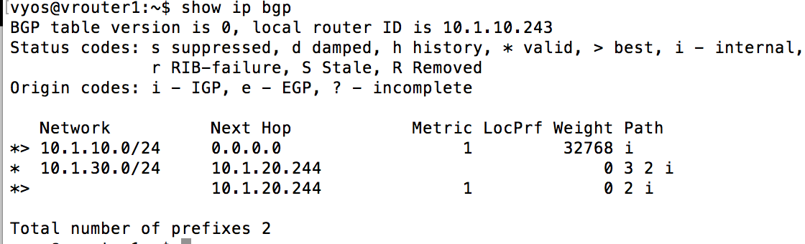
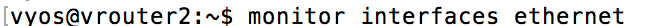
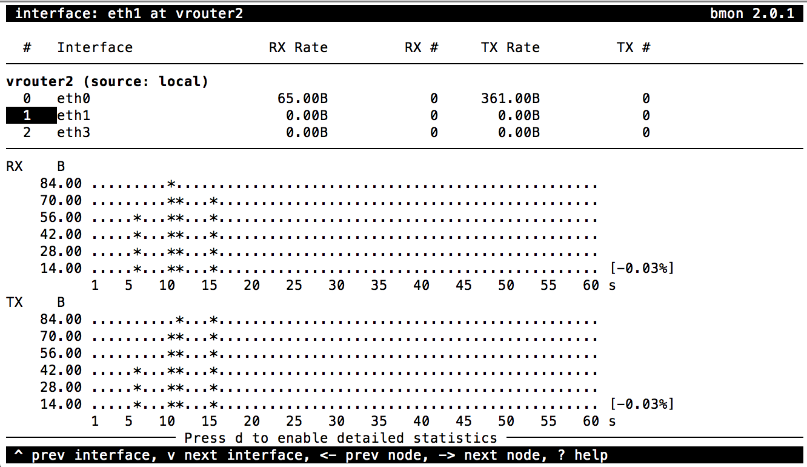

Prepare traffic visualization and monitoring
============================================

- Connect to Windows jumphost using RDP

- Open SSH connections to Router1 and Router2

-  Verify Router1 BGP configuration. Protected subnet ``10.1.30.0/24`` should have a Next Hop defined as Router2 ``10.1.20.244``
    ``show ip bgp``

        |image3|

-  Start interface monitoring in Router1 and Router2
   ``monitor interfaces ethernet``

    |image5|
    |image6|
    |image4|
    |image7|

-  Select *eth1* and press ``g`` to enable graphical statistics

   .. note:: You may need to expand terminal window for graphs to appear

-  Open Web Browser and click on `BIG-IP AFM` bookmark, then login into BIG-IP TMUI using ``admin`` credentials

-  Open **DoS Visibility Dashboard** in AFM TMUI

    |image8|

-  In a new Browser tab click on `Flowmon Web interface` bookmark. Once Flowmon main menu opens, click on `Flowmon DDoS Defender` icon and login using ``admin`` credentials

-  Open **Attack List** in Flowmon DDoS Defender WebUI

    |image9|

.. NOTE:: Disregard any active alarms Flowmon may show in the upper right screen corner. These are artifcts of this lab environment

.. |image5| image:: ../images/image5.png
   :scale: 55%
.. |image6| image:: ../images/image6.png
   :scale: 55%

.. |image8| image:: ../images/image8.png
   :scale: 60%
.. |image9| image:: ../images/image9.png
   :scale: 50%
