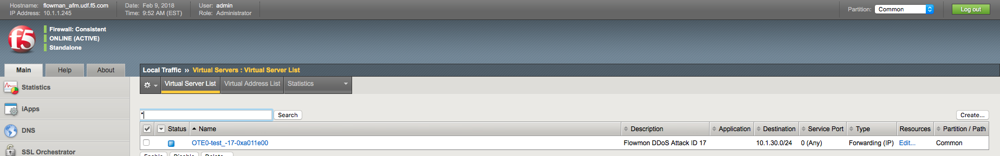

Initiate DDoS attack
====================

Run SYN flood (hping3) from Attacker VM
---------------------------------------

- Click on **Attacker SSH** icon to open ``Attacker VM`` ssh session

- From Attacker VM run SYN flood towards Web server

    ``./syn_flood``

    |image10|

-  Observe traffic growth in both Router1 and Router2. After **15-45
   seconds** traffic will drop in Router2 due to DDoS detection and
   mitigation start

    |image11|

DDoS mitigation start
---------------------

An *ACTIVE* attack with the new ID will appear in Flowmon DDoS defender
‘Active attacks’ screen. Flowmon dynamically provisions AFM DDoS profile
and VS, and initiates traffic diversion to AFM using BGP advertisement

|image12|

|image13|

BGP route change and traffic drop
---------------------------------

-  Router1 shows new route to protected ``10.1.30.0/24`` subnet

    ``show ip bgp``

    |image14|

-  As traffic is being routed through AFM, Router2 shows no significant
   network activity while Router1 still experiences high traffic load

    |image15|

AFM DDoS profile and virtual server
-----------------------------------

.. NOTE:: Flowmon uses iControl REST interface to provision necessary parameters in AFM

-  In AFM TMUI Navigate to **Security --> DoS protection --> DoS profiles** and confirm that
   the DoS profile has been provisioned for the protected subnet

    |image16|

-  In **Local Traffic --> Virtual Servers --> Virtual Server List** confirm that
   VS with corresponding Attack ID has been created

    |image17|

AFM DDoS mitigation
-------------------

In AFM TMUI navigate to **Security --> DoS Protection --> DoS Overview** and
confirm that AFM is performing DoS mitigation using the provisioned DoS
profile

|image18|

.. NOTE:: `Statistics -> DoS Visibility` TMUI menu provides graphical attack data

It may take up to ~5 minutes for DoS Visibility Dashboard to show our simulated DDoS attack. You may need to click `Refresh` for data to appear

|image26|

.. |image10| image:: images/image10.png
   :scale: 75%
.. |image11| image:: images/image11.png
   :scale: 35%
.. |image12| image:: images/image12.png
   :scale: 60%
.. |image13| image:: images/image13.png
.. |image14| image:: images/image14.png
.. |image15| image:: images/image15.png
   :scale: 60%
.. |image16| image:: images/image16.png
   :scale: 50%

.. |image18| image:: images/image18.png
   :scale: 60%
.. |image26| image:: images/image26.png
   :scale: 85%
