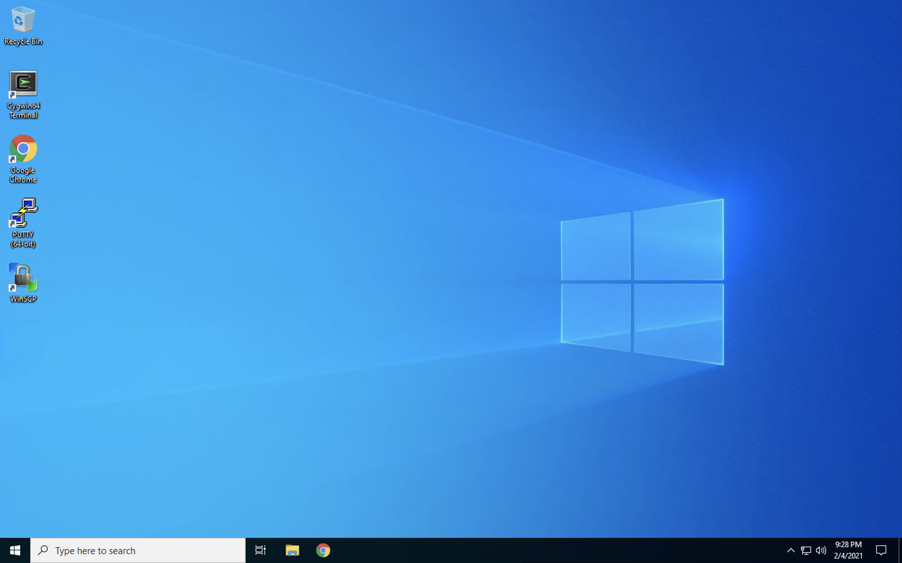
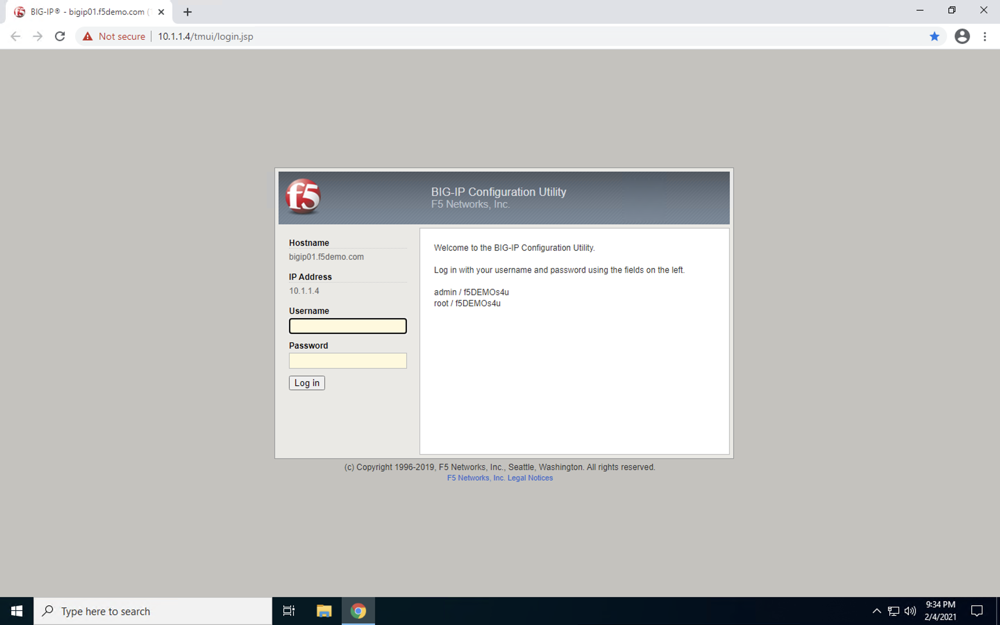
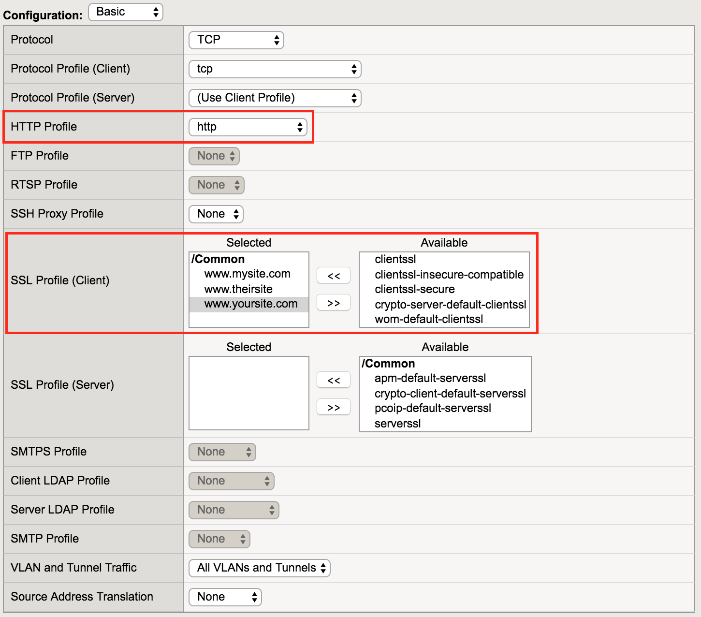
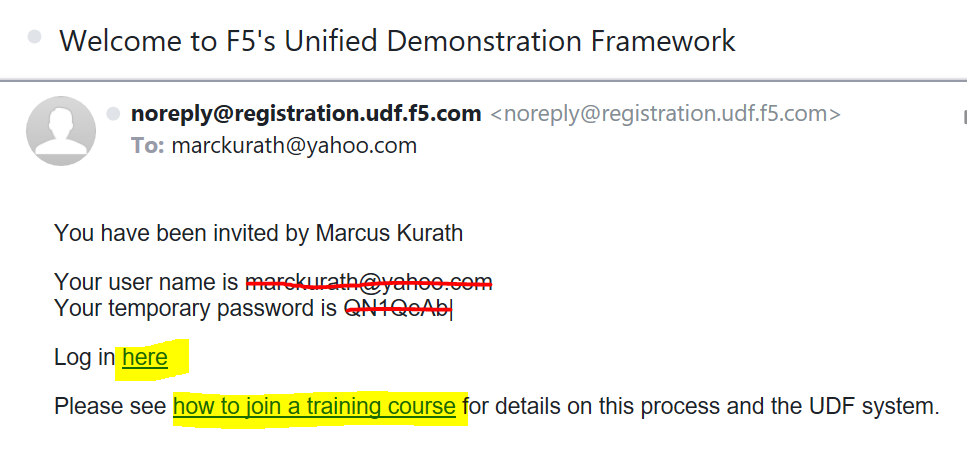
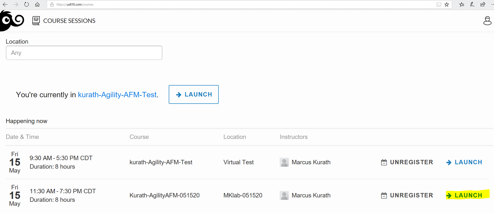
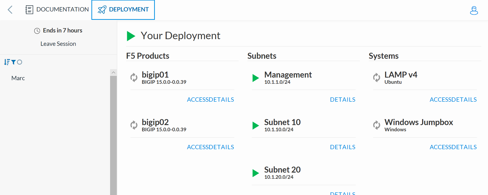

Lab 1: Pre-configured pools and virtual servers
===============================================

A virtual server is used by BIG-IP to identify specific types of
traffic. Other objects such as profiles, policies, pools and iRules are
applied to the virtual server to add features and functionality. In the
context of security, since BIG-IP is a default-deny device, a virtual
server is necessary to accept specific types of traffic.

The pool is a logical group of hosts that is applied to and will receive
traffic from a virtual server.

|image1|

Firewall Rule Hierarchy
-----------------------

With the BIG-IP\ :sup:`®` Advanced Firewall Manager (AFM), you can apply network ACLs to several different contexts to
configure the level of specificity of a firewall rule or policy. For example, you might make a global context rule to block ICMP ping
messages, and you might make a virtual server context rule to allow only a specific network to access an application.

Context is processed in this order:

-  Global
-  Route domain
-  Virtual server / self IP
-  Management port\*
-  Global drop\*

The firewall processes policies and rules in order, progressing from the
global context, to the route domain context, and then to either the
virtual server or self IP context. Management port rules are processed
separately, and are not processed after previous rules. Rules can be
viewed in one list, and viewed and reorganized separately within each
context. You can enforce a firewall policy on any context except the
management port. You can also stage a firewall policy in any context
except management.

|image300|

.. tip:: You cannot configure or change the Global Drop context. The Global Drop context is the final context for traffic. Note that even though it is a global context, it is not processed first, like the main global context, but last. If a packet matches no rule in any previous context, the Global Drop rule drops the traffic.

Inspect Application Pools
-------------------------

After connecting to the jump host via RDP, click on the Chrome shortcut on the desktop or task bar.

The BIG-IP login screen should open in the first tab. Other tabs will open with links to applications that we will test later in the lab.

Enter the credentials shown in the welcome message and click **Log In**.

Verify the following pools using the following tabel of pool information.  

Navigate to **Local Traffic** > **Pools** > **Pool List**.

.. list-table::
   :header-rows: 1

   * - **Name**
     - **Health Monitor**
     - **Members**
     - **Service Port**
   * - pool\_www.site1.com
     - http
     - 10.1.20.11
     - 80
   * - pool\_www.site2.com
     - http
     - 10.1.20.12
     - 80
   * - pool\_www.site3.com
     - http
     - 10.1.20.13
     - 80
   * - pool\_www.site4.com
     - http
     - 10.1.20.14
     - 80
   * - pool\_www.site5.com
     - http
     - 10.1.20.15
     - 80
   * - pool\_dvwa.com
     - tcp\_half\_open
     - 10.1.20.17
     - 80
   * - IDS\_pool
     - gateway_icmp
     - 10.1.20.252
     - 

This screenshot shows an example of the pool list in the TMUI:

.. image:: ../images/image162.png

Inspect Application Virtual Servers
-----------------------------------

This lab uses the term "internal" to refer to the network and hosts
protected by the firewall. "External" refers to the network and hosts
that are exposed to the public/internet. The EXT_VIP in this exercise is used to forward traffic 
with specific characteristics to the internal VIP's. This is 
accomplished by assigning a traffic policy to the VIP. The traffic 
policy is described and inspected in the next section. For this 
class, the Wildcard Virtual servers (Blue Square status indicator) 
are not used. 

Navigate to **Local Traffic** > **Virtual Servers** > **Virtual Server List**.

|image163|

Inspect the Local Traffic Network Map
-------------------------------------

The Network Map page in the Configuration utility provides a hierarchical view of BIG-IP local traffic objects, such as virtual servers, pools, and iRules. It displays the status for each component and the relationships between components, and it provides additional component information on the accompanying panels.

Starting in BIG-IP 14.1.0, you can use the Network Map page for a variety or administrative tasks. You can view the status of the object, such as a pool member that may be marked offline, or view statistical information for the object, such as the current connection count for a virtual server. You can also view the relationship of one object to another, such as the parent-child relationship between a virtual server and a pool.

To view the network map, navigate to **Local Traffic** > **Network Map**.

|image7|

.. note:: The virtual servers should show a green circle for status.

This completes Module 1 - Lab 1. Click **Next** to continue.

.. |image163| image:: ../images/image163.png
.. |image1| image:: ../images/image3.png
.. |image2| image:: ../images/image4.png
   :width: 6.74931in
   :height: 5.88401in
.. |image3| image:: ../images/image5.png
   :width: 7.05556in
   :height: 1.33333in
.. |image4| image:: ../images/image6.png
   :width: 7.05556in
   :height: 3.22222in
.. |image5| image:: ../images/image7.png
   :width: 7.05556in
   :height: 7.31944in
.. |image6| image:: ../images/image8.png
   :width: 7.05000in
   :height: 3.46949in
.. |image7| image:: ../images/image7.png
   :width: 7.05000in
   :height: 5.46949in
.. |image8| image:: ../images/image10.png
   :width: 7.05556in
   :height: 2.63889in

.. |image10| image:: ../images/image12.png
   :width: 7.05556in
.. |image300| image:: ../images/image300.png
   :width: 7.05556in

.. |image304| image:: ../images/image304.png
   :width: 7.05556in
