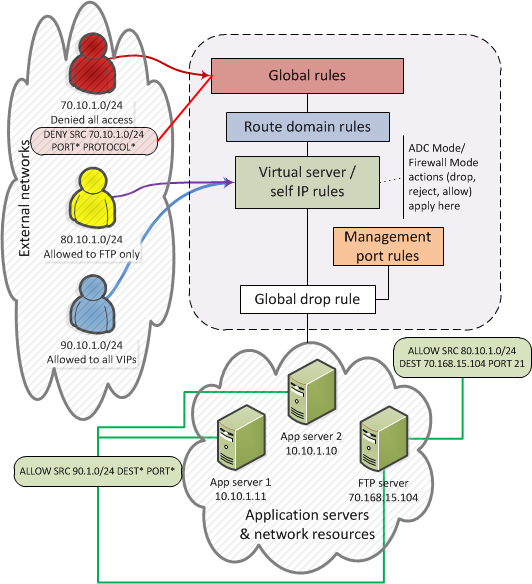
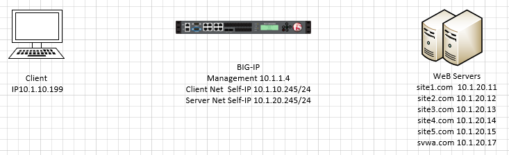
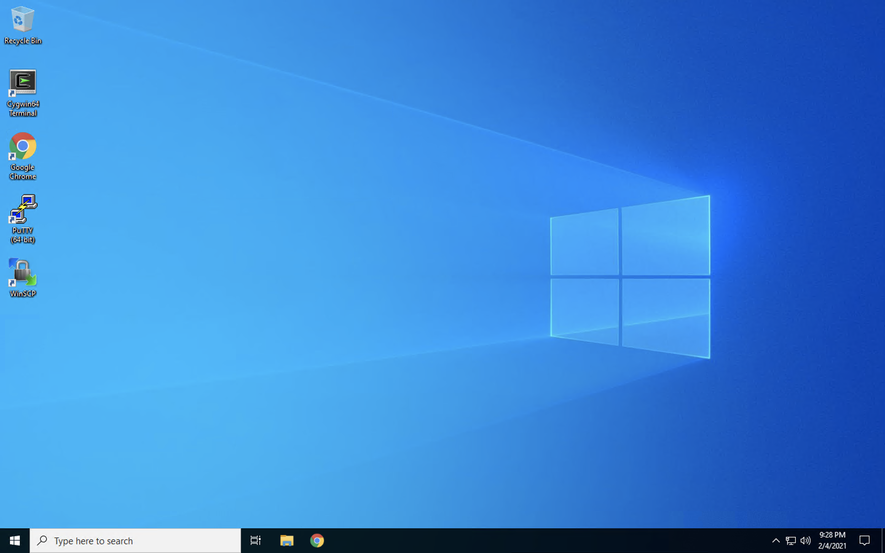
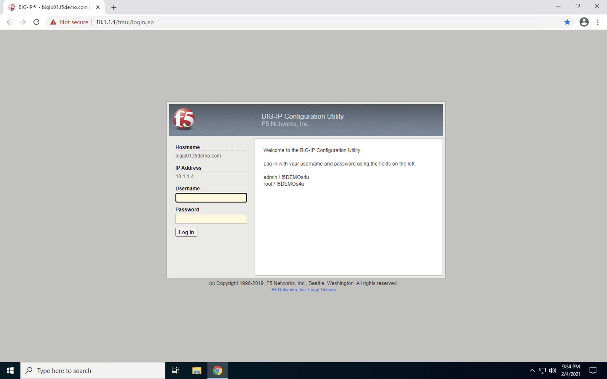
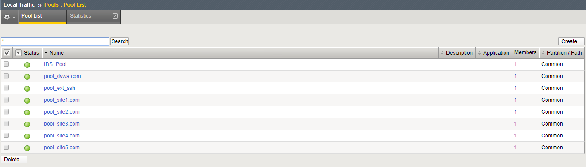
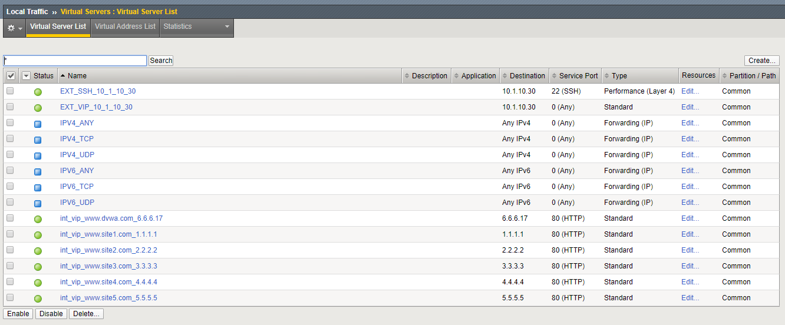
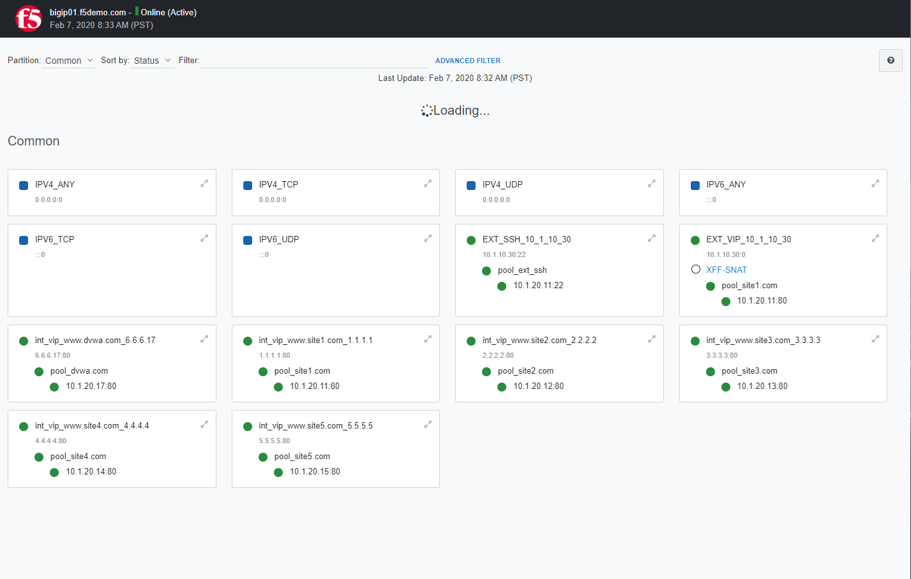

Firewall Rule Hierarchy
-----------------------

With the BIG-IP\ :sup:`®` Network Firewall, you use a context to configure the level of specificity of a firewall rule or policy. For example, you might make a global context rule to block ICMP ping messages, and you might make a virtual server context rule to allow only a specific network to access an application.

Context is processed in this order:

-  Global
-  Route domain
-  Virtual server / self IP
-  Management port\*
-  Global drop\*

The firewall processes policies and rules in order, progressing from the global context, to the route domain context, and then to either the virtual server or self IP context. Management port rules are processed separately, and are not processed after previous rules. Rules can be viewed in one list, and viewed and reorganized separately within each context. You can enforce a firewall policy on any context except the management port. You can also stage a firewall policy in any context except management.

.. tip:: You cannot configure or change the Global Drop context. The Global Drop context is the final context for traffic. Note that even though it is a global context, it is not processed first, like the main global context, but last. If a packet matches no rule in any previous context, the Global Drop rule drops the traffic.

=================================================
Lab 1: Pre-configured  pools and  virtual servers
=================================================

A virtual server is used by BIG-IP to identify specific types of traffic. Other objects such as profiles, policies, pools and iRules are applied to the virtual server to add features and functionality. In the context of security, since BIG-IP is a default-deny device, a virtual server is necessary to accept specific types of traffic.

The pool is a logical group of hosts that is applied to and will receive traffic from a virtual server.

Inspect Application Pools
-------------------------

After connecting to the jump host via RDP, click on the Chrome shortcut on the desktop or task bar.

The BIG-IP login screen should open in the first tab. 

Enter the credentials shown in the welcome message and click **Log In**.

Verify the following pools using the following tabel of pool information.  

**Navigation:** Local Traffic > Pools > Pool List

.. note:: Other pools may exist than the ones in the table below. The pools in this table are the ones relevant to this class.

.. list-table::
   :header-rows: 1

   * - **Name**
     - **Health Monitor**
     - **Members**
     - **Service Port**
   * - pool\_www.site1.com
     - http
     - 10.1.20.11
     - 80
   * - pool\_www.site2.com
     - http
     - 10.1.20.12
     - 80
   * - pool\_www.site3.com
     - http
     - 10.1.20.13
     - 80
   * - pool\_www.site4.com
     - http
     - 10.1.20.14
     - 80
   * - pool\_www.site5.com
     - http
     - 10.1.20.15
     - 80
   * - pool\_www.dvwa.com
     - tcp\_half\_open
     - 10.1.20.17
     - 80

This screenshot shows an example of the pool list in the TMUI:

Inspect Application Virtual Servers
-----------------------------------

By using the term 'internal' we are creating the virtual servers on 
what is essentially a loopback VLAN which prevents them from being 
exposed. The EXT_VIP in this exercise is used to forward traffic 
with specific characteristics to the internal VIP's. This is 
accomplished by assigning a traffic policy to the VIP. The traffic 
policy is described and inspected in the next section. For this 
class, the Wildcard Virtual servers (Blue Square status indicator) 
are not used. 

**Navigation:** Local Traffic > Virtual Servers > Virtual Server List

Inspect the Local Traffic Network Map
-------------------------------------

**Navigation:** Local Traffic > Network Map

.. note:: The virtual servers should show a green circle for status.

This completes Module 1 - Lab 1. 
