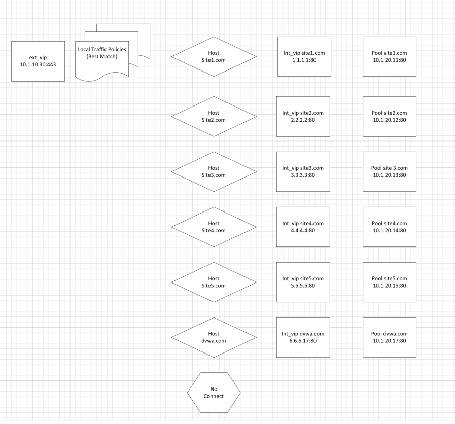
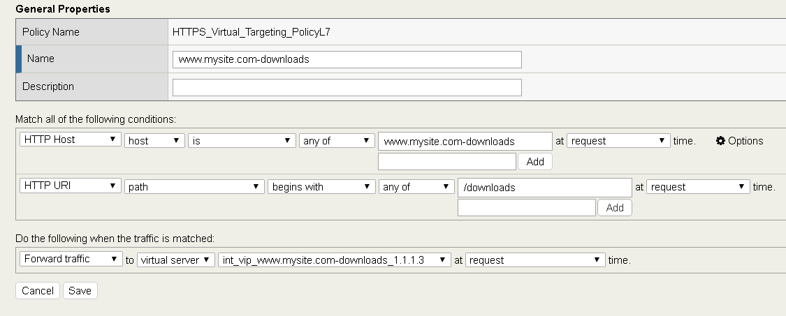
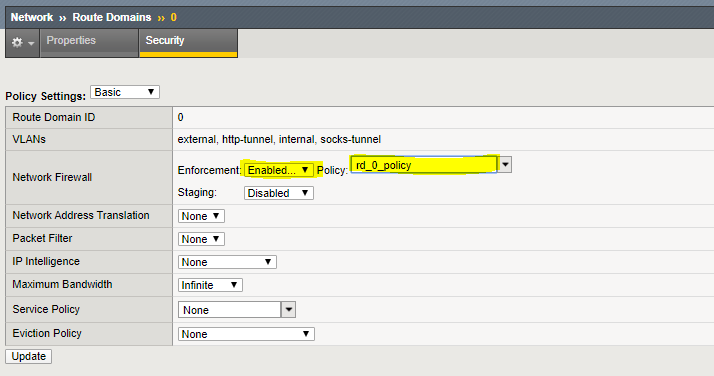

====================================================
Lab 2: Permitting traffic to pass to virtual servers
====================================================

Create an ACL to allow web traffic and SSH
------------------------------------------

The rules created in this section allow basic connectivity to the resources.
We will add enforcement rules at the virtual server level to demonstrate functionality.

On bigip01.f5demo.com (10.1.1.4) create a rule list to allow
traffic. A logical container will be created before the individual rules
can be added. You will create a list with rules to allow port 80
(HTTP), 443 (HTTPS), and 22 (SSH)  to servers 10.1.20.11 through 10.1.20.17 We will
also create a rules which allows HTTPS and SSH traffic to access 10.1.10.30

Create a container for the rules by going to:

**Navigation:** Security > Network Firewall > Rule Lists

**Navigation:** Click on **Create**.

For the **Name** enter **web_rule_list**, provide an optional description

**Navigation** click **Finished**

|image270|

|image269|

**Navigation** Select  the **web_rule_list** by clicking on it in the Rule Lists table

**Navigation** click the **Add** button in the Rules section. 

Add a rules into the list to allow HTTP, HTTPS, and SSH  traffic as described in the next steps

|image276|

+-------------------------+-------------------------------------------------------------------------------------------------+
| **Name**                | allow_http_and_https                                                                            |
+=========================+=================================================================================================+
| **Protocol**            | TCP                                                                                             |
+-------------------------+-------------------------------------------------------------------------------------------------+
| **Source**              | Leave at Default of **Any**                                                                     |
+-------------------------+-------------------------------------------------------------------------------------------------+
| **Destination Address** | Pulldown **Specify Address Range** 10.1.20.11 to 10.1.20.17, then click **Add**                 |
+-------------------------+-------------------------------------------------------------------------------------------------+
| **Destination Port**    | Pulldown **Specify…** Port **80**, click **Add**  **Specify…** Port **443**, click **Add**      |
+-------------------------+-------------------------------------------------------------------------------------------------+
| **Action**              | **Accept**                                                                                      |
+-------------------------+-------------------------------------------------------------------------------------------------+
| **Logging**             | Enabled                                                                                         |
+-------------------------+-------------------------------------------------------------------------------------------------+

**Navigation:** Click Repeat

Add a rule into the list to allow HTTPS to Virtual Server 10_1_10_30.

+-------------------------+-----------------------------------------------------------+
| **Name**                | allow_any_10_1_10_30                                      |
+=========================+===========================================================+
| **Protocol**            | TCP                                                       |
+-------------------------+-----------------------------------------------------------+
| **Source**              | Leave at Default of **Any**                               |
+-------------------------+-----------------------------------------------------------+
| **Destination Address** | Pulldown **Specify...**\ 10.1.10.30 then click **Add**    |
+-------------------------+-----------------------------------------------------------+
| **Destination Port**    | Pulldown **Specify…** Port **Any**, then click **Add**    |
+-------------------------+-----------------------------------------------------------+
| **Action**              | **Accept**                                                |
+-------------------------+-----------------------------------------------------------+
| **Logging**             | Enabled                                                   |
+-------------------------+-----------------------------------------------------------+

**Navigation:** Click **Finished**

|image272|

**Navigation:** Click Finished

Assign the Rule List to a Policy 
--------------------------------

**Navigation:** Security > Network Firewall > Policies

**Navigation** Click Create

For the **Name** enter **rd_0_policy**, provide an optional description

**Navigation** click **Finished**.

(Note: We commonly use “RD” in our rules to help reference the “Route
Domain”, default is 0)**

|image273|

**Navigation** Edit the **rd_0_policy** by clicking on it in the Policy Lists table, 

**Navigation** click the **Add Rule List** button. 

**Navigation** For the **Name,** start typing **web_rule_list**, you will notice the name will auto complete, 

**Navigation** select the rule list **/Common/web_rule_list**, provide an optional description

**Navigation** click **Done Editing.**

|image274|

You will notice the changes are unsaved and need to be committed to the
system. This is a nice feature to have enabled to verify you want to
commit the changes you’ve just made without a change automatically being
implemented.

**Navigation** click **“Commit Changes to System"**

Assign the rd_0_policy to Route Domain 0
----------------------------------------

**Navigation:** Network > Route Domains

**Navigation:** Click on the "0" to select Route Domain 0

**Navigation:** Select the Security Tab

Set **Enforcement** to **Enable** and select the **rd_0_policy** 

**Navigation** Click Update

|Image275|

Configure BIG-IP Firewall in ADC Mode
-------------------------------------

By default, the Network Firewall is configured in **ADC mode**, a
default allow configuration, in which all traffic is allowed through the
firewall, and any traffic you want to block must be explicitly
specified.

The system is configured in this mode by default so all traffic on your
system continues to pass after you provision the Advanced Firewall
Manager. You should create appropriate firewall rules to allow necessary
traffic to pass before you switch the Advanced Firewall Manager to
Firewall mode. In **Firewall mode**, a default deny configuration, all
traffic is blocked through the firewall, and any traffic you want to
allow through the firewall must be explicitly specified.

In deployments where there are a large number of VIP's, deploying in 
Firewall mode would require significant preperation. Firewall 
functionality is easier to introduce in ADC mode. 

**Navigation:** Security > Options > Network Firewall 

+-----------------------------------------+---------+
| **Virtual Server & Self IP Contexts**   | Accept  |
+-----------------------------------------+---------+

**Navigation** Click **Update**

|image251|

Open the **Firewall Options** tab.

Validate Lab 2 Configuration
----------------------------

.. Note:: Open a tab on the Chrome Browser to test access to the URL's below

**Validation:** This lab is using self-signed certificates. You can
either open a web browser on the test client or run CURL from the CLI to
validate your configuration.

**You will need to accept the certificate to proceed to the application sites**

.. code-block:: console

    URL: https://site1.com

    URL: https://site2.com

    URL: https://site3.com

    URL: https://site4.com

    URL: https://site5.com

    URL: https://dvwa.com    Username:  admin    Password: password

**With curl you need to use the -k option to ignore certificate validation**

.. Note:: From a terminal window (use Cygwin on Win7 Client Desktop). Curl will let us do some of the additional testing in later sections. If you scroll up to the text immediately following the command you will see the IP address of the pool member you connected to.

.. code-block:: console

    curl -k https://10.1.10.30 -H Host:site1.com

    curl -k https://10.1.10.30 -H Host:site2.com

    curl -k https://10.1.10.30 -H Host:site3.com

    curl -k https://10.1.10.30 -H Host:site4.com

    curl -k https://10.1.10.30 -H Host:site5.com

|image264|

This completes Module 1 - Lab 2. Click **Next** to continue.

.. |image9| image:: _images/class2/image11.png
   :width: 7.05556in
   :height: 6.20833in
.. |image10| image:: _images/class2/image12.png
   :width: 7.05556in
   :height: 3.45833in
.. |image11| image:: _images/class2/image13.png
   :width: 7.08611in
   :height: 1.97069in
.. |image12| image:: _images/class2/image14.png
   :width: 7.04167in
   :height: 2.62500in

.. |image14| image:: _images/class2/policy2.png
   :width: 7.05000in
   :height: 4.29861in
.. |image15| image:: _images/class2/image17.png
   :width: 7.05556in
   :height: 1.68056in
.. |image16| image:: _images/class2/image18.png
   :width: 7.05000in
   :height: 2.35764in
.. |image17| image:: _images/class2/image19.png
   :width: 7.04167in
   :height: 2.25000in
.. |image18| image:: _images/class2/image20.png
   :width: 7.05556in
   :height: 0.80556in
.. |image19| image:: _images/class2/image21.png
   :width: 7.05556in
   :height: 3.34722in
.. |image20| image:: _images/class2/image22.png
   :width: 7.04167in
   :height: 2.56944in
.. |image21| image:: _images/class2/image23.png
   :width: 7.04167in
   :height: 2.59722in
.. |image22| image:: _images/class2/image24.png
   :width: 7.04167in
   :height: 4.31944in
.. |image23| image:: _images/class2/image25.png
   :width: 7.05000in
   :height: 1.60208in
.. |image262| image:: _images/class2/image262.png
   :width: 7.05000in
   :height: 5.60208in
.. |image263| image:: _images/class2/image263.png
   :width: 7.05000in
   :height: 4.60208in
.. |image264| image:: _images/class2/image264.png
   :width: 7.05000in
   :height: 3.60208in
.. |image269| image:: _images/class2/image269.png
   :width: 7.05000in
   :height: 3.60208in
.. |image270| image:: _images/class2/image270.png
   :width: 6.05000in
   :height: 2.60208in
.. |image271| image:: _images/class2/image271.png
   :width: 7in
   :height: 7in
.. |image272| image:: _images/class2/image272.PNG
   :width: 7in
   :height: 7in
.. |image273| image:: _images/class2/image273.PNG
   :width: 6.05000in
   :height: 2.60208in
.. |image274| image:: _images/class2/image274.png
   :width: 7.05000in
   :height: 2.90208in

.. |image276| image:: _images/class2/image276.png
   :width: 7.05556in
   :height: 3.45833in
.. |image251| image:: _images/class2/image251.png
   :width: 3.05556in
   :height: 2.45833in
