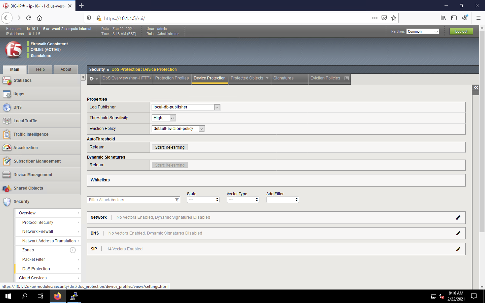
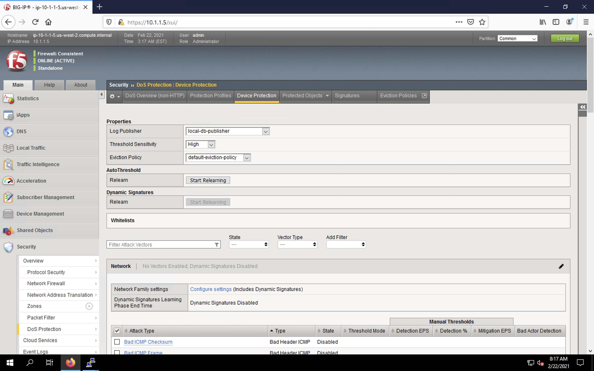
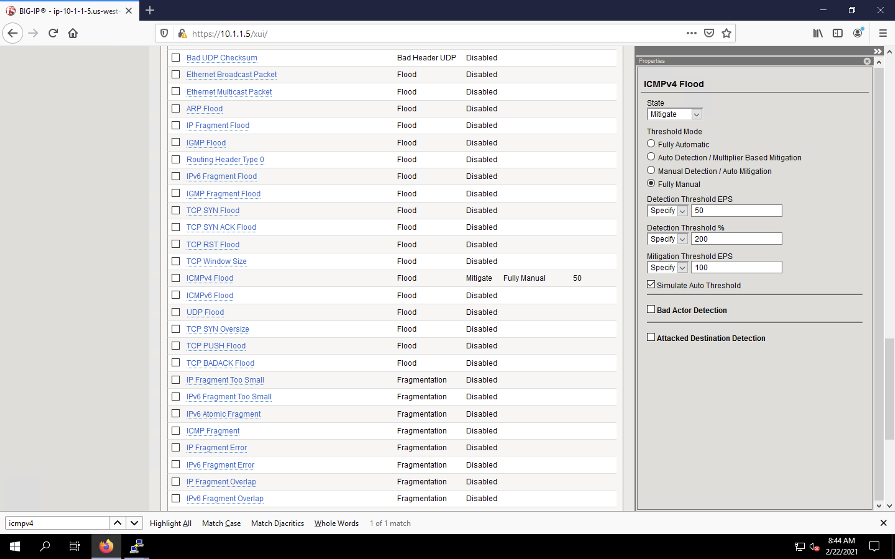
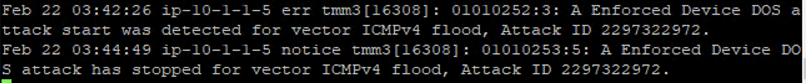
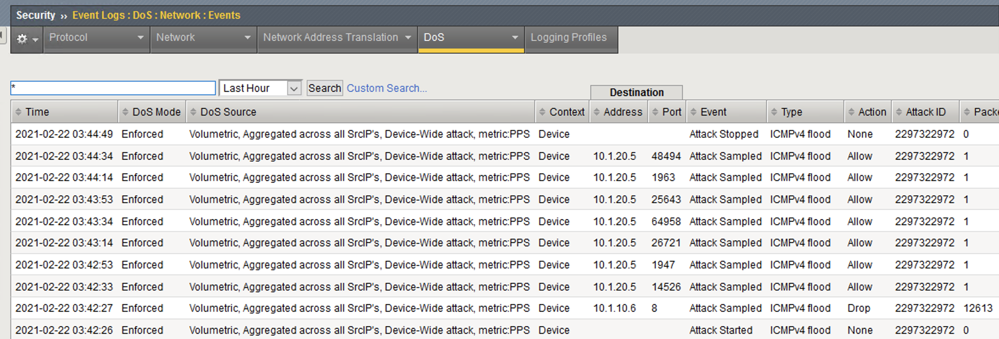
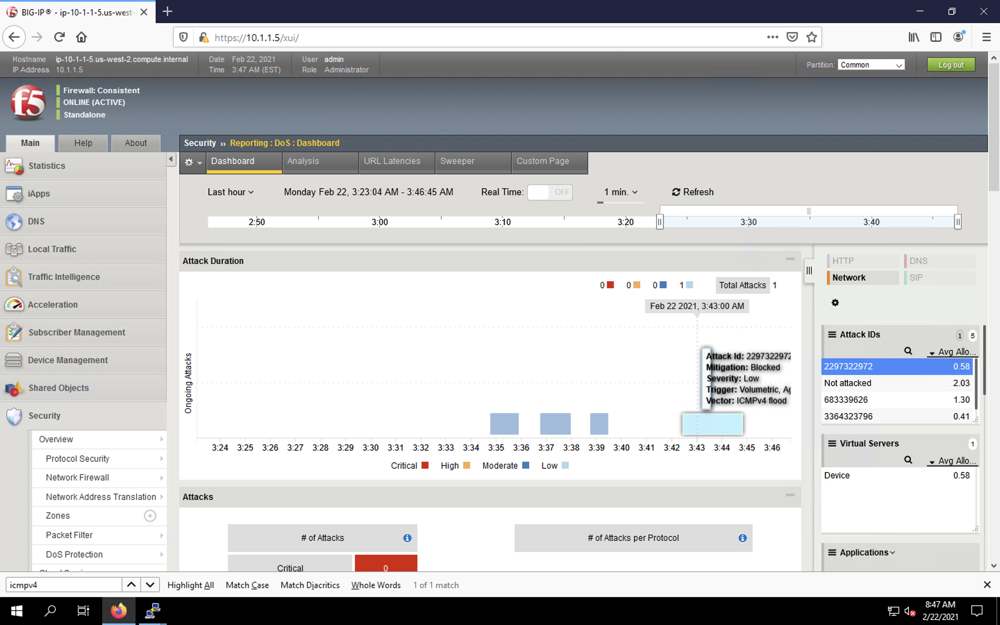

Simulating a ICMPv4 Flood Attack
================================

In this example, we’ll set the BIG-IP to detect and mitigate an ICMPv4 flood attack. This type
of attack attempts disrupt a network host with a flood of traffic from a seemingly harmless protocol.

Configure Logging
-----------------

Configuring a logging destination will allow you to verify the BIG-IPs detection and mitigation 
of attacks, in addition to the built-in reporting.

1. In the BIG-IP web UI, navigate to **Security** > **DoS Protection** > **Device Protection**.

2. Under **Log Pubisher**, select *local-db-publisher*.
3. Set the **Threshold Sensitivity** to *high*.
4. Click the **Network** section header in the vector list to expand the view.

5. Scroll down to find the *ICMPv4 flood* category in the vectors list. Click on the vector name.
6. In the vector configuration pane, set the following values:
    - **State**: *Mitigate*
    - **Threshold Mode**: *Fully Manual*
    - **Detection Threshold EPS**: *Specify 50*
    - **Detection Threshold Percent**: *Specify 200*
    - **Mitigation Threshold EPS**: *Specify 100*

7. Scroll to the top of the page and click the **Commit Changes to System** button.

Initiate the Attack
-------------------

We’ll use the hping utility to send 25,000 packets to our server, with random source IPs to simulate a DDoS attack where multiple hosts are attacking our server. We’ll set the SYN, ACK, FIN, RST, URG, PUSH, Xmas and Ymas TCP flags.

1. Minimize Firefox and click the BIG-IP shortcut. You will automatically be logged in as admin.
2. Issue the ``bash`` command to enter the BASH prompt.
3. Scroll the ltm log in real time with the following command: 
    - ``tail -f /var/log/ltm``
4. On the attack host, launch the attack by issuing the following command on the BASH prompt: 
    - ``sudo hping3 10.1.10.6 --flood --rand-source --icmp -c 25000``
5. You’ll see the BIG-IP ltm log show that the attack has been detected.

6. After approximately 60 seconds, press **CTRL+C** to stop the attack.
7. Return to the BIG-IP web UI. Navigate to **Security** > **Event Logs** > **DoS** > **Network** > **Events**. Observer the log entries showing the details surrounding the attack detection and mitigation.

8. Navigate to **Security** > **Reporting** > **DoS** > **Dashboard**. View the various statistics surrounding the attack.
9. Navigate to **Security** > **Reporting** > **DoS** > **Analysis**. View additional statistics surrounding the attack.

