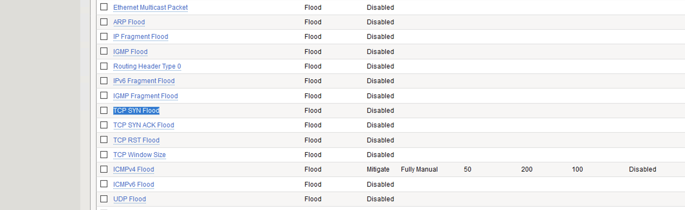
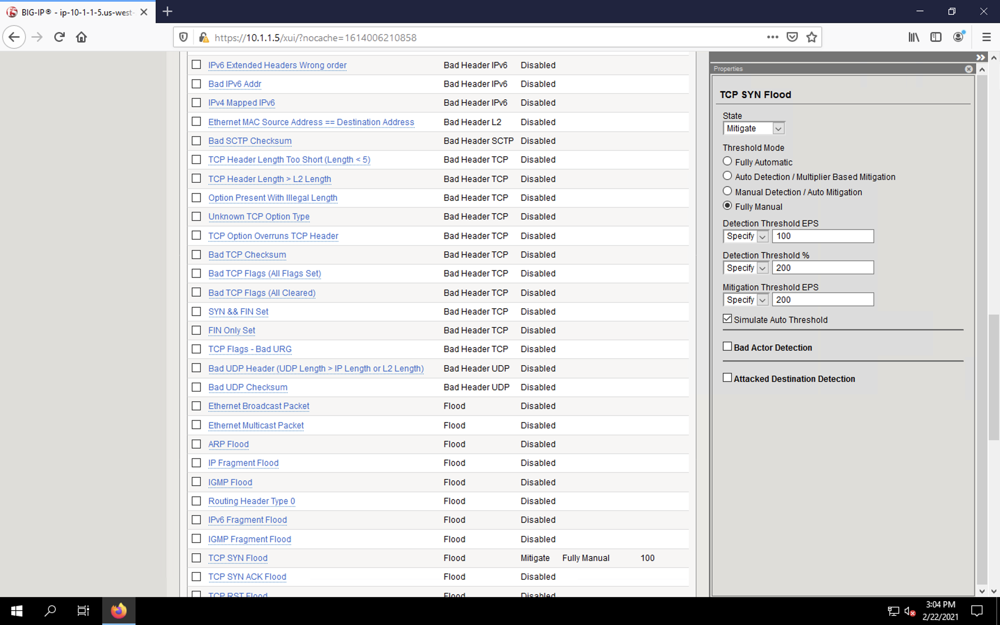
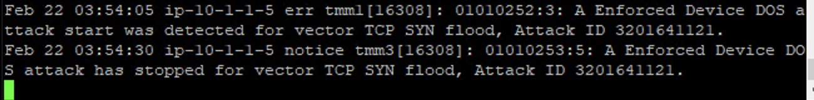
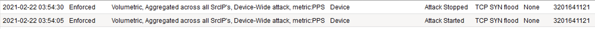
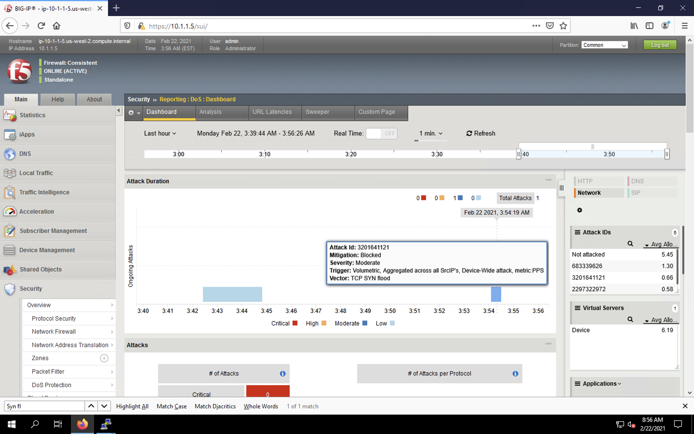
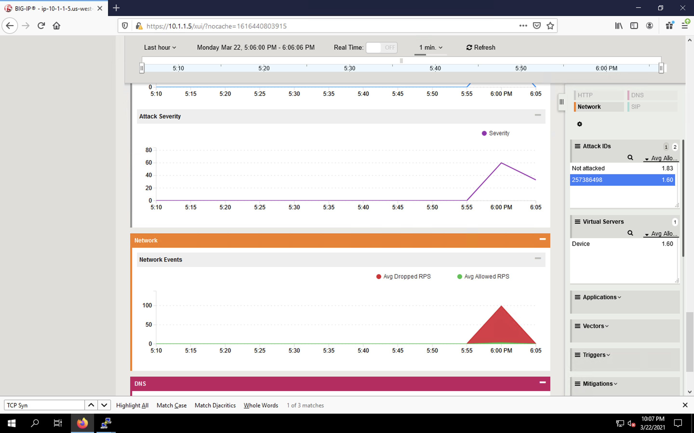

Simulating a TCP SYN DDoS Attack
================================

In the last example, we generated traffic that is somewhat easily identified as malicious, as its doesn't look like normal user traffic. We’ll now simulate an attack with traffic that could be normal, acceptable traffic. The TCP SYN flood attack will attempt to DDoS a host by sending valid TCP traffic to a host from multiple source hosts. This will generate a flood of traffic that could be a surge in site visits or malicious.

1. In the BIG-IP web UI, navigate to **Security** > **DoS Protection** > **Device Protection**.
2. Expand the **Network** section header in the vectors list to expand the view.
3. Click on **TCP Syn Flood** vector name.

4. Configure the vector with the following parameters:
    - **State**: *Mitigate*
    - **Threshold Mode**: *Fully Manual*
    - **Detection Threshold EPS**: *100*
    - **Detection Threshold Percent**: *200*
    - **Mitigation Threshold EPS**: *200*
    - **Simulate Auto Threshold**: Checked

5. Scroll to the top of the page and click **Commit Changes to System**.
6. Open the BIG-IP SSH session and ensure the ltm log file is still being monitored:
    - ``tail -f /var/log/ltm``
7. On the attack host, launch the attack by issuing the following command on the BASH prompt: 
    - ``sudo hping3 10.1.10.6 --flood --rand-source --destport 80 --syn``
8. You will see messages showing the attack has been detected in the /var/log/ltm output:

. After about 60 seconds, stop the flood attack by pressing **CTRL+C**.
9. Return to the BIG-IP web UI and navigate to **Security** > **Event Logs** > **DoS** > **Network** > **Events**. Observe the log entries showing the details surrounding the attack detection and mitigation.

10. Navigate to **Security** > **Reporting** > **DoS** > **Dashboard** to view an overview of the DoS attacks and timeline. You can select filters in the filter pane to highlight the specific attack.

11. Finally, navigate to **Security** > **Reporting** > **DoS** > **Analysis**. View detailed statistics around the attack.

