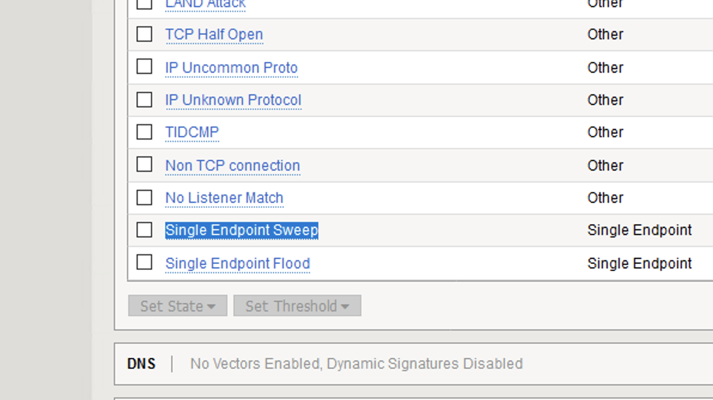
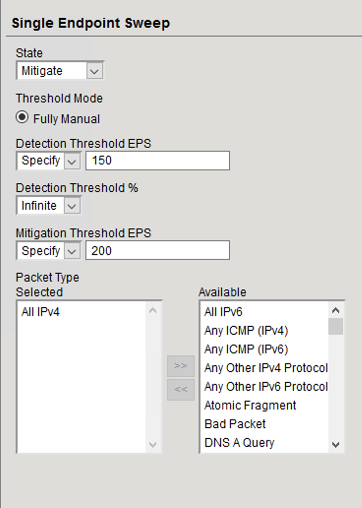
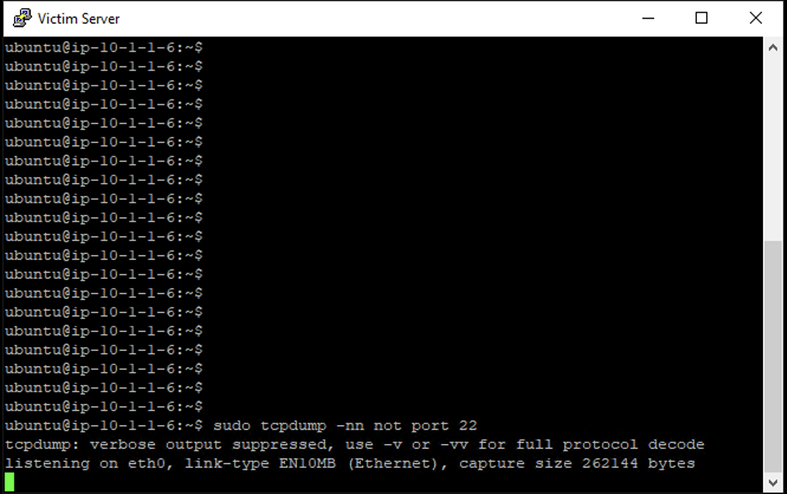
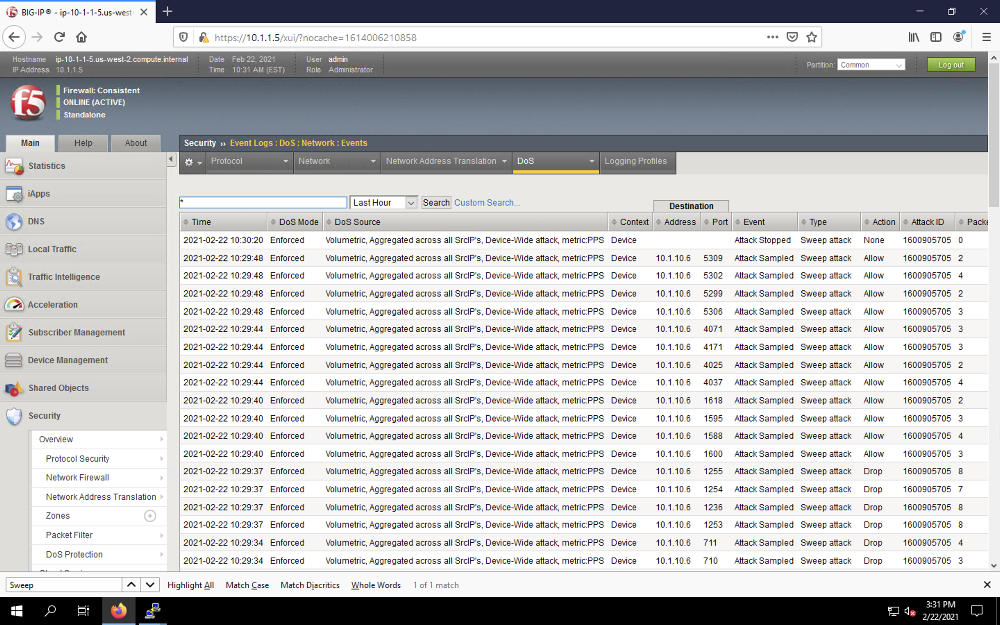
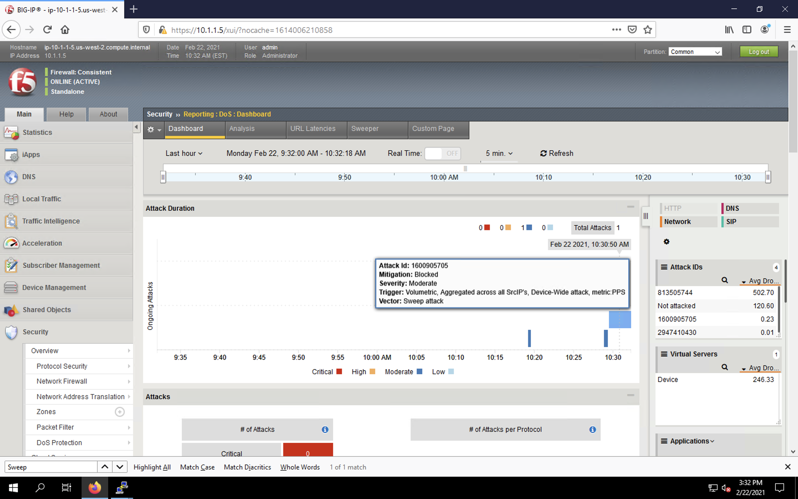
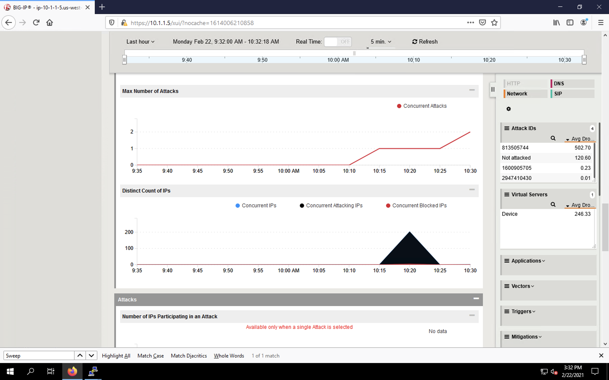

Preventing Global DoS Sweep and Flood Attacks
=============================================

DoS Protection profile
----------------------

In the last section, the focus was on attacks originating from various hosts. In this section, we will 
focus on mitigating flood and sweep attacks from a single host. 

Single Endpoint Sweep
---------------------

The single endpoint sweep is an attempt for an attacker to send traffic across a range of ports on the target server, typically to scan for open ports.

1. In the BIG-IP web UI, navigate to **Security** > **DoS Protection** > **Device Protection**.
2. Click the **Network** section header to expand the vector list view.
3. Scroll to the bottom of the Network section and click on the **Single Endpoint Sweep** category in the vectors list.

4. Configure the vector with the following parameters:
    - **State**: *Mitigate*
    - **Threshold Mode**: *Fully Manual*
    - **Detection Threshold EPS**: *150*
    - **Mitigation Threshold EPS**: *200*
    - **Packet Type**: *Move All IPv4 to Selected*

5. Scroll to the top of the page and click **Commit Changes to System**.
6. Open the BIG-IP SSH session and ensure the ltm log file is still being monitored:
     - ``tail -f /var/log/ltm``
7. On the victim server, start a packet capture with an SSH filter by issuing 
     - ``sudo tcpdump -nni eth1 tcp and not port 22``

8. On the attack host, launch the attack by issuing the following command on the BASH prompt: 
    - ``sudo hping3 10.1.10.6 --flood --scan 1-65535 -d 128 -w 64 --syn``

9. You will see the scan find a few open ports on the server, and the server will show the inbound sweep traffic. However, you will notice that the traffic to the server stops after a short time (10 seconds, the configured sustained attack detection time.) Don't stop the test.

.. image:: _images/image071.png
    :alt:  screenshot

10. After a few minutes, stop the sweep attack on the attack host by pressing **CTRL+C**.
11. Return to the BIG-IP web UI and navigate to **Security** > **Event Logs** > **DoS** > **Network** > **Events**. Observe the log entries showing the details surrounding the attack detection and mitigation.

12. Navigate to **Security** > **Reporting** > **DoS** > **Dashboard** to view an overview of the DoS attacks and timeline. You can select filters in the filter pane to highlight the specific attack.

13. Finally, navigate to **Security** > **Reporting** > **DoS** > **Analysis**. View detailed statistics around the attack.

This concludes our lab. 
