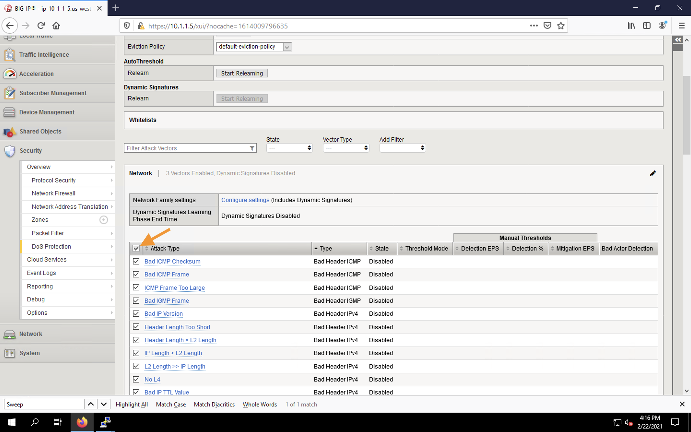
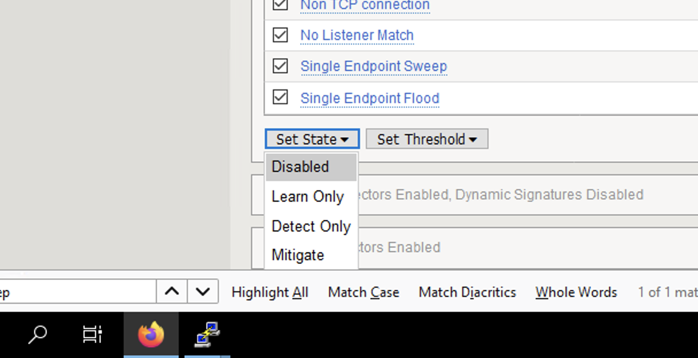
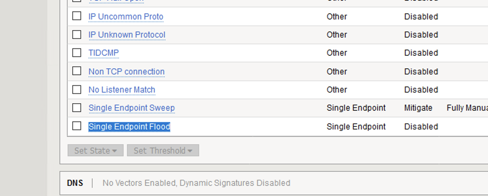
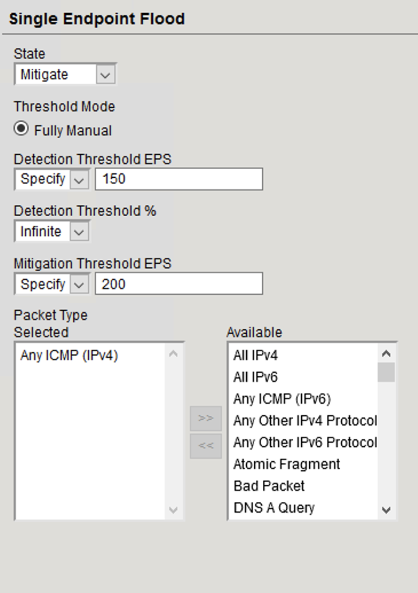
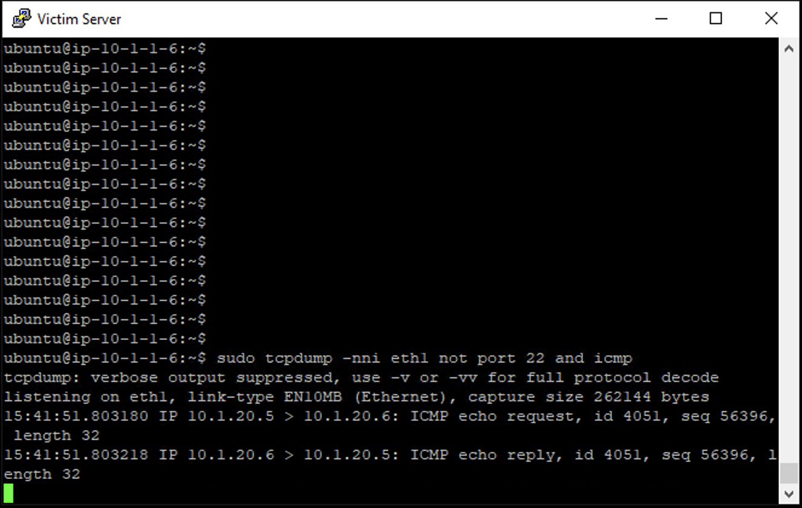
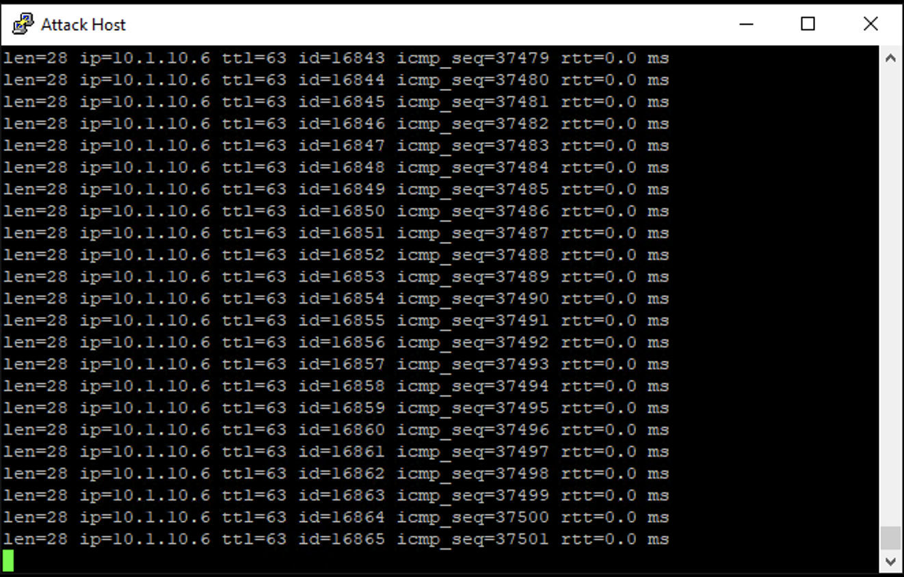
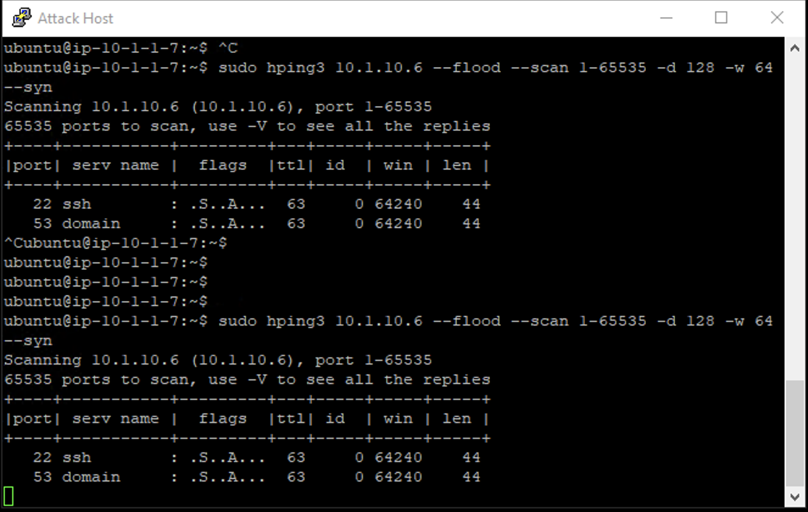

Single Endpoint Flood
=====================

The single endpoint flood attack is an attempt for an attacker to send a flood of traffic to a host in hopes of overwhelming a service to a point of failure. In this example, we’ll flood the target server with ICMP packets.

1. In the BIG-IP web UI, navigate to **Security** > **DoS Protection** > **Device Protection**.
2. Click on the **Network** section header to expand the view and scroll to the bottom of the page.
3. Click the checkmark at the top of the vector list to select all vectors.

4. Scroll to the bottom of the page and choose *Disabled* from the **Set State** drop-down as shown.

5. Scroll to the top and click **Commit Changes to System** to disable the current vectors.
6. In the same screen, scroll down and click on **Single Endpoint Flood** vector name.

7. Configure the vector with the following parameters:
     - **State**: *Mitigate*
     - **Threshold Mode**: *Fully Manual*
     - **Detection Threshold EPS**: *150*
     - **Mitigation Threshold EPS**: *200*
     - **Packet Type**: *Move Any ICMP (IPv4) to Selected*

8. Scroll to the top of the page and click **Commit Changes to System**.
9. Open the BIG-IP SSH session and ensure the ltm log file is still being monitored:
    - ``tail -f /var/log/ltm``
10. We’ll run a packet capture on the victim server to gauge the incoming traffic. On the victim server, issue the following command: 
    - ``sudo tcpdump -nni eth1 not port 22 and icmp``

11. On the attack host, launch the attack by issuing the following command on the BASH prompt: 
    - ``sudo hping3 10.1.10.6 --flood --faster -c 250000 --icmp``

12. The attack host will begin flooding the victim server with ICMP packets. After several seconds, the flood will stop. 
13. Return to the BIG-IP web UI.
14. Navigate to **Security** > **Event Logs** > **DoS** > **Network** > **Events**. Observe the log entries showing the details surrounding the attack detection and mitigation.

15. Navigate to **Security** > **Event Logs** > **Network** > **IP Intelligence**. Observe the log entries showing the mitigation of the sweep attack via the ip-intelligence policy.

16. Navigate to **Security** > **Reporting** > **Network** > **IP Intelligence**. Observe the statistics showing the sweep attack and mitigation.

17. Navigate to **Security** > **Reporting** > **DoS** > **Dashboard** to view an overview of the DoS attacks and timeline. You can select filters in the filter pane to highlight the specific attack.

18. Finally, navigate to **Security** > **Reporting** > **DoS** > **Analysis**. View detailed statistics around the attack.

