Base BIG-IP Configuration
=========================

In this lab, the VE has been configured with the basic system settings and the VLAN/self-IP configurations required for the BIG-IP to communicate and pass traffic on the network. We’ll now need to configure the BIG-IP to listen for traffic and pass it to the back end server.

1. Connect to the Jump Host desktop and launch the Firefox shortcut titled **Launch BIG-IP Web UI** on the desktop of your lab jump server.

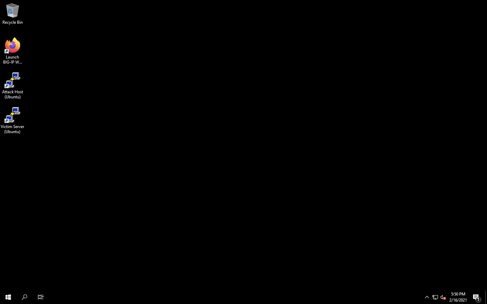

2. The credentials for the BIG-IP are conveniently displayed in the login banner. Just in case: **admin / f5agility!**

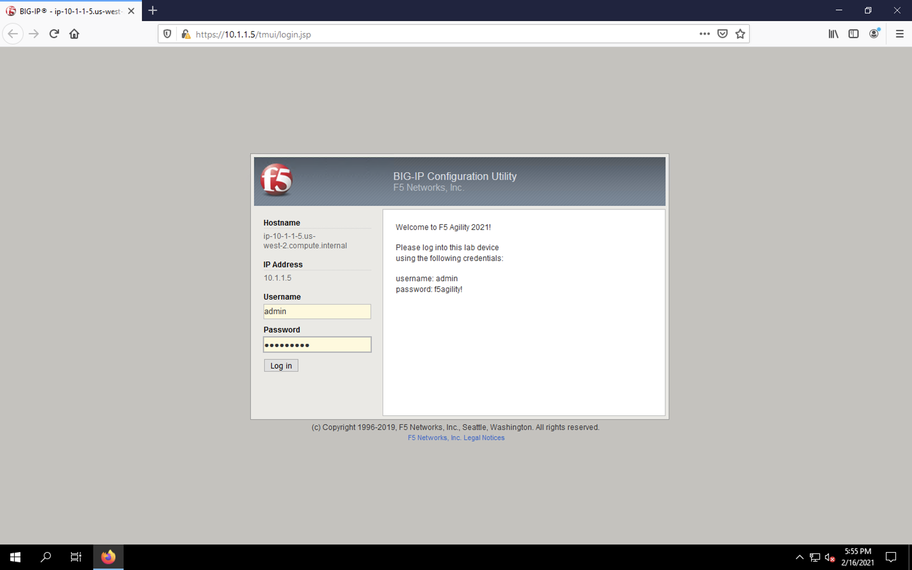

3. Navigate to **Local Traffic** > **Nodes** and create a new node with the following settings, leaving unspecified fields at their default value:

- **Name**: *lab-server-10.1.20.6*
- **Address**: *10.1.20.6*

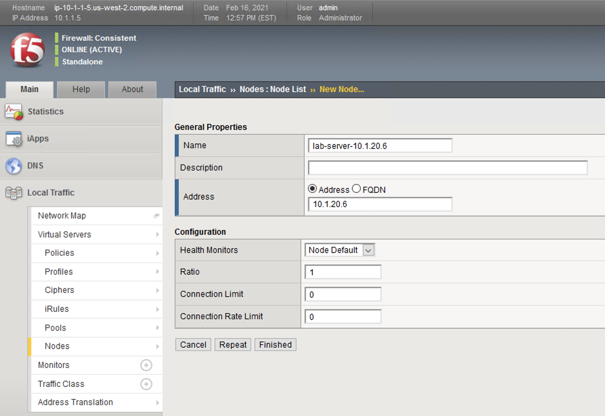

4. Click **Finished** to add the new node.

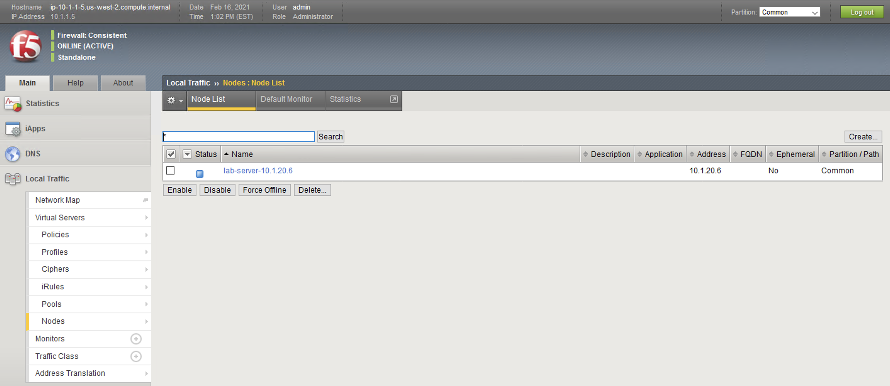

5. Navigate to **Local Traffic** > **Pools** and create a new pool with the following settings, leaving unspecified attributes at their default value:
     - **Name**: *lab-server-pool*
     - **Health Monitors**: *gateway_icmp*
     - **New Members**: *Node List* and create a single node with the following settings:        
       - **Address**: *lab-server-10.1.20.6*
       - **Service Port**: *\* (All Ports)* 

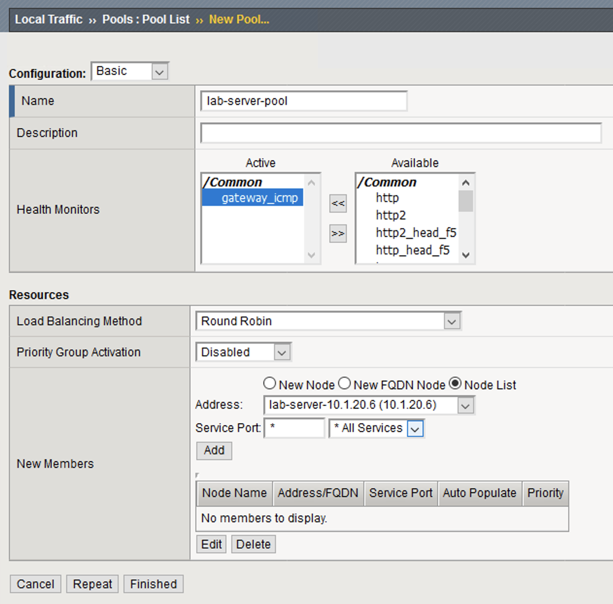

6. Click **Add** to add the new member to the member list. You will see the new member populate in the node list. 

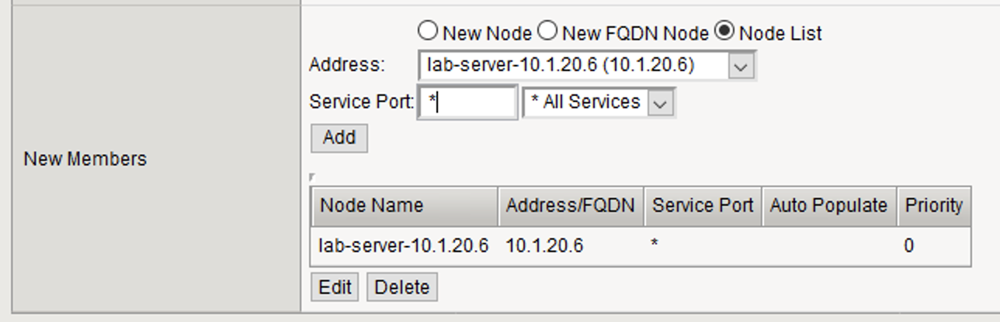

7. Click **Finished** to create the new pool.

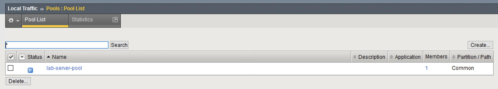

8. Because the attack server will be sending a huge amount of traffic, we’ll need a fairly large SNAT pool. Navigate to **Local Traffic** > **Address Translation** > **SNAT Pool List** and create a new SNAT pool with the following attributes:
     - **Name**: *inside_snat_pool*
     - **Member List**: *10.1.20.125, 10.1.20.126, 10.1.20.127, 10.1.20.128, 10.1.20.129, 10.1.20.130*

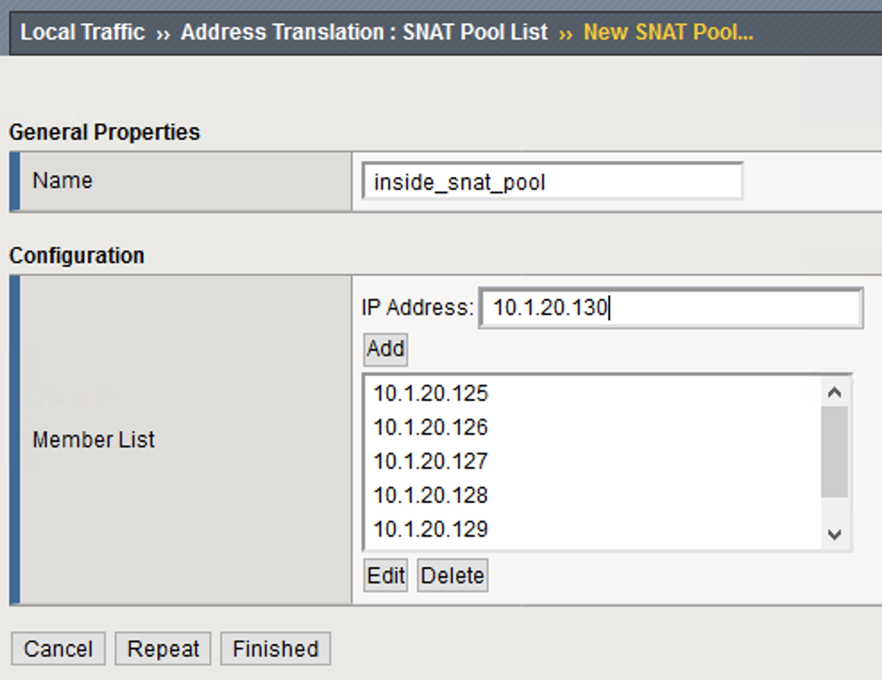

9. Click **Finished** to commit your changes.

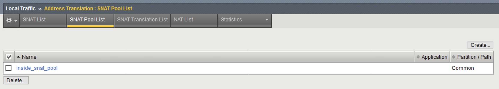

10. Navigate to **Local Traffic** > **Virtual Servers** and create a new virtual server with the following settings, leaving unspecified fields at their default value:
     - **Name**: *udp_dns_VS*
     - **Destination Address/Mask**: *10.1.10.6*
     - **Service Port**: *53*
     - **Protocol**: *UDP*
     - **Source Address Translation**: *SNAT*
     - **SNAT Pool**: *inside_snat_pool*
     - **Default Pool**: *lab-server-pool*

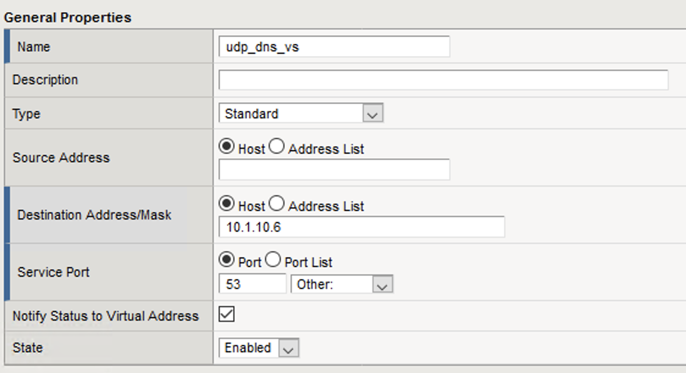

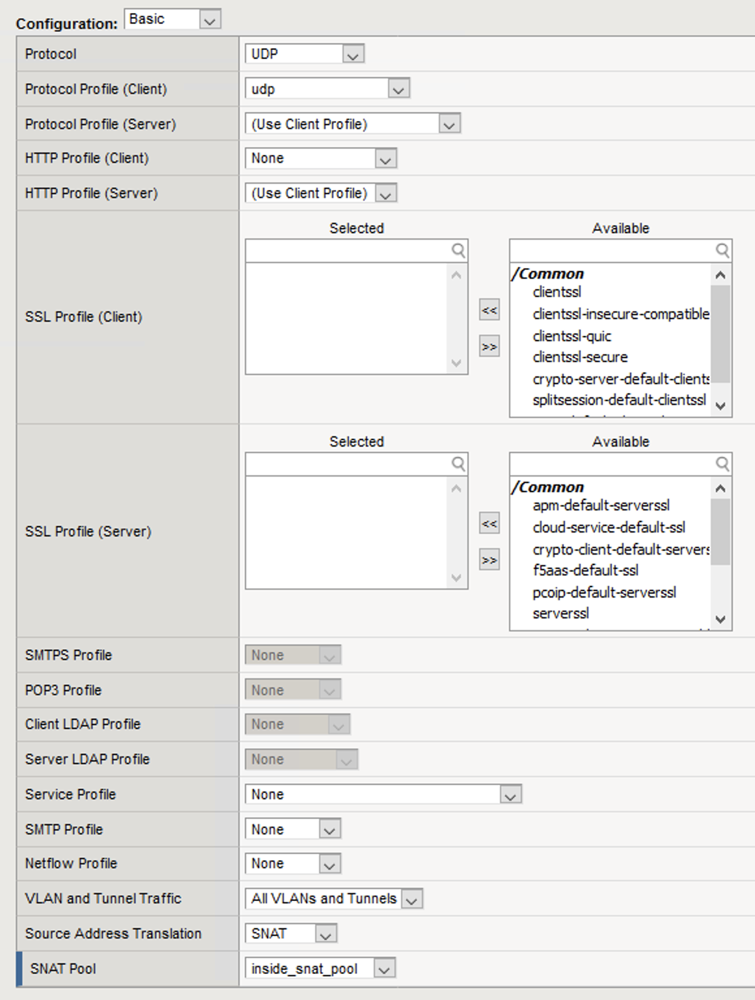

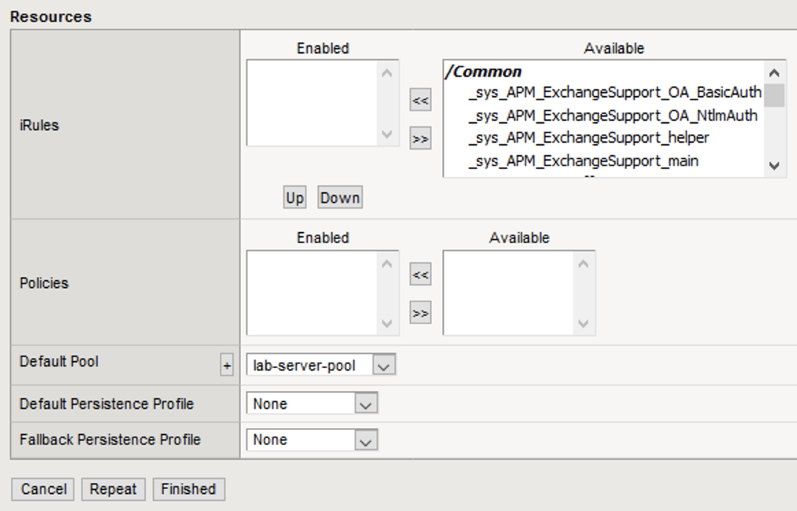

11. Click **Finished**.

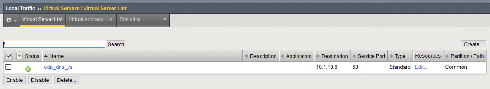

12. We’ll now test the new DNS virtual server. SSH into the attack host by clicking the **Attack Host (Ubuntu)** icon on the jump host desktop. 
13. Issue the ``dig @10.1.10.6 www.example.com +short`` command on the BASH CLI of the attack host. This verifies that DNS traffic is passing through the BIG-IP.
14. Return to the BIG-IP and navigate to **Local Traffic** > **Virtual Servers** and create a new virtual server with the following settings, leaving unspecified fields at their default value:
     - **Name**: *other_protocols_VS*
     - **Destination Address/Mask**: *10.1.10.6*
     - **Service Port**: *\* (All Ports)*
     - **Protocol**: *\* All Protocols*
     - **Any IP Profile**: *ipother*
     - **Source Address Translation**: *SNAT*
     - **SNAT Pool**: *inside_snat_pool*
     - **Default Pool**: *lab-server-pool*

15. Return to the Attack Host SSH session and attempt to SSH to the server using ``SSH 10.1.10.6``. Simply verify that you are prompted for credentials and press CTRL+C to cancel the session. This verifies that non-DNS traffic is now flowing through the BIG-IP.

.. note:: At this point, you have a functional DNS server, an attack host with tools needed to simulate DoS/DNS attacks, and a BIG-IP with a base configuration that allows the attack host to reach the victim server.

Click **Next** to continue.