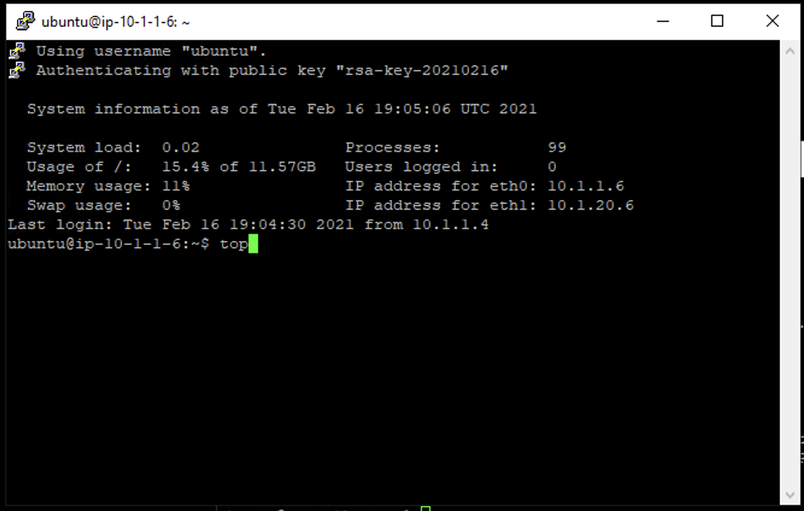
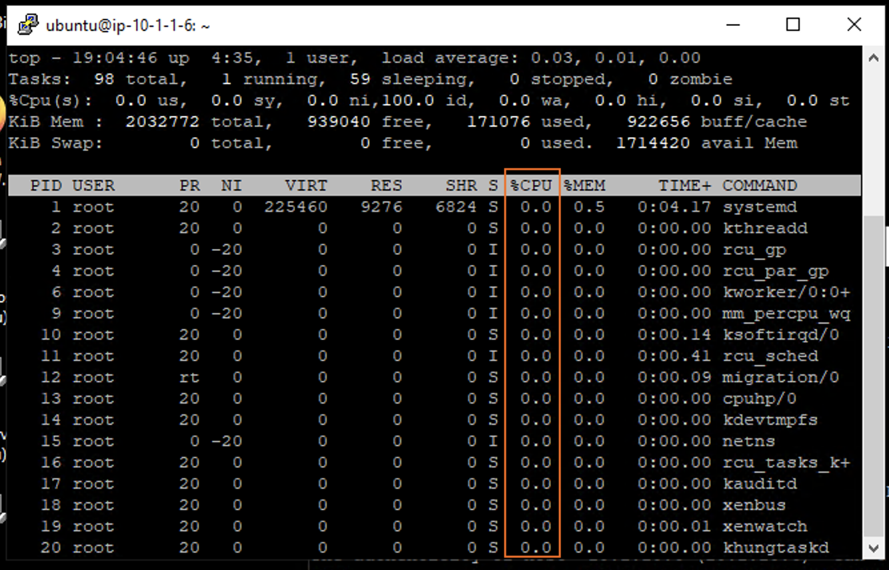
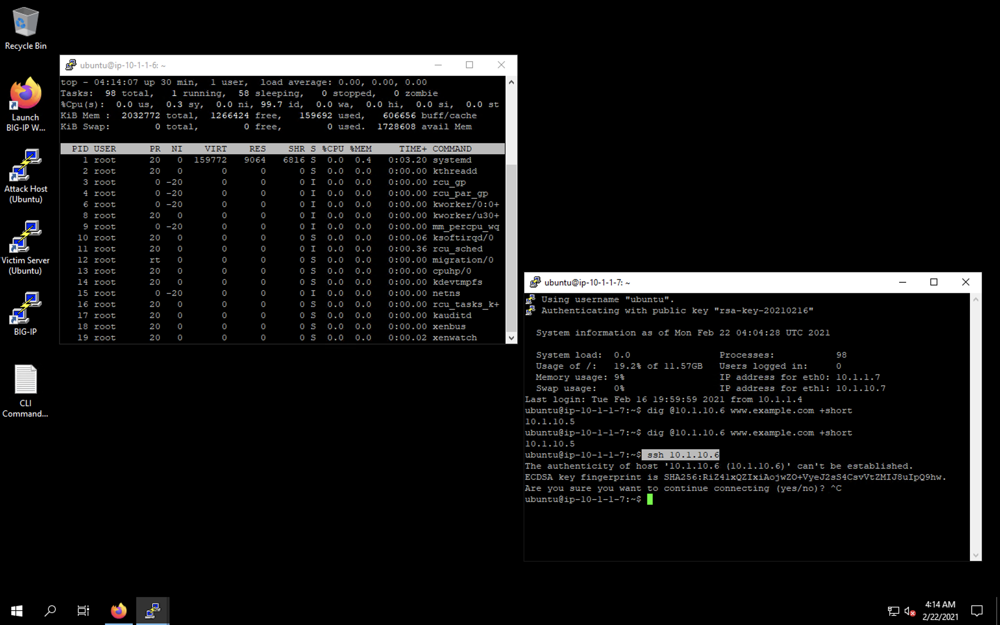
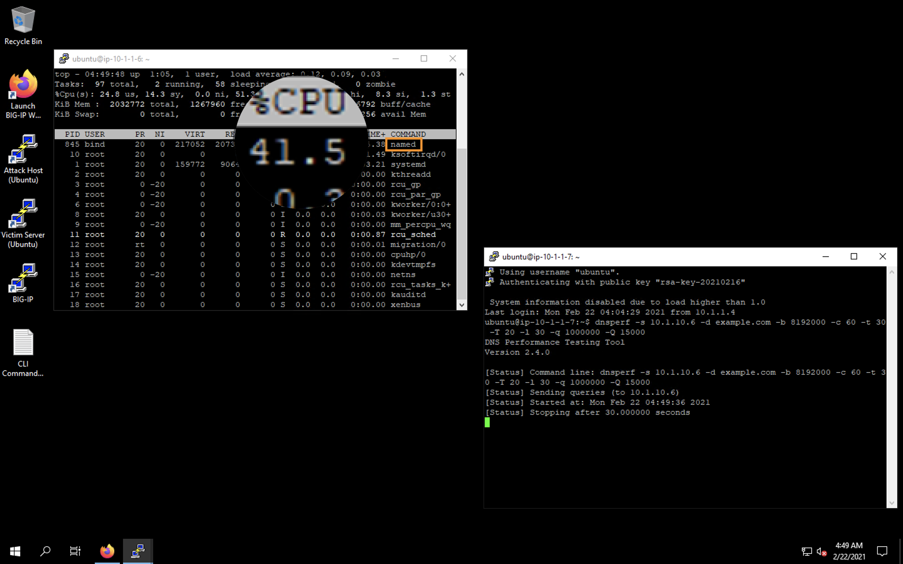
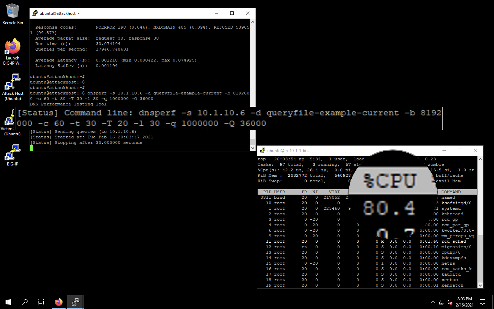
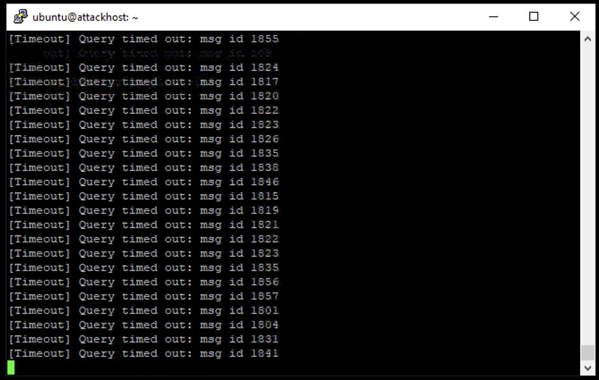

Detecting and Preventing DNS DoS Attacks on a Virtual Server
============================================================

Establishing a DNS server baseline
----------------------------------

Before we can attack our DNS server, we should establish a baseline for how many QPS our DNS server can handle. For this lab, let’s find the magic number of QPS that causes 50% CPU utilization on the BIND process.

1. Minimize all windows. Connect to the Victim Server SSH session by double-clicking the **Victim Server (Ubuntu)** shortcut on the jump host desktop.

2. From the BASH prompt, enter ``top`` and press **Enter** to start the top utility.

3. You will see a list of running processes sorted by CPU utilization, like the output below. Observe the values under the ``%CPU`` column. The DNS daemon will appear in this list as ``named`` and may not be visible until the test begins.

4. Re-open the Attack Host SSH session from the taskbar (or if closed, by double-clicking the **Attack Host (Ubuntu)** shortcut on the jump host desktop). Move the windows so that you can see the output of the top command on the attack victim while executing commands on the attack host.

5. Start by sending 15,000 DNS QPS for 30 seconds to the host using the following syntax: 
    - ``dnsperf -s 10.1.10.6 -d example.com -b 8192000 -c 60 -t 30 -T 20 -l 30 -q 1000000 -Q 15000``

6. Observe CPU utilization over the 30 second window for the named process. 

7. Observe the dnsperf statistics after the test has finished. Notice the number of queries sent and number of queries lost.

.. image:: _images/image024.png
  :alt: screenshot

8. If the percentage of lost queries was 0%, increase the QPS by increasing the -Q value and rerun the test. If the percentage of lost queries was over a few percentage points, lower the -Q value and run the test again. We want to find the maximum QPS before a significant number of queries are lost.

9. Record the QPS required to achieve < 1.00% lost queries. Consider this the QPS that the server can safely sustain for demonstration purposes. 

10. Now, attack the DNS server with a 10x your baseline QPS using the following syntax (modify the -Q value): 
      - `` dnsperf -s 10.1.10.6 -d queryfile-example-current -b 8192000 -c 60 -t 30 -T 20 -l 30 -q 1000000 -Q 150000``
   
    This uses a different data file full of random domain queries. You’ll notice that the CPU utilization on the victim server skyrockets. 

11. You will also likely see DNS query timeout errors appearing on the attack server’s SSH session. This shows your DNS server is overwhelmed.

Click **Next** to continue.