Configuring a DoS Logging Profile
---------------------------------

We’ll create a DoS logging profile so that we can see event logs in the BIG-IP UI during attack mitigation.

1. On the BIG-IP web UI, navigate to **Security** > **Event Logs** > **Logging Profiles** and create a new profile with the following values, leaving unspecified attributes at their default value:
    - **Profile Name**: *dns-dos-profile-logging*
    - **DoS Protection**: *Enabled*
    - **DNS DoS Protection Publisher**: *local-db-publisher*

.. image:: _images/image028.png
  :alt: screenshot

2. Click **Create** to finish the configuration.

About profiles for DoS and protocol service attacks
---------------------------------------------------

On the BIG-IP® system, you can use different types of profiles to detect and 
protect against system DoS attacks, to rate limit possible attacks, and to 
automatically blacklist IP addresses when identified as Bad Actors. You can 
configure settings for specific protocol attacks for DNS, and other network 
attacks.

With AFM, you can also configure manual responses to DoS vectors. For non-error 
packets, you can specify absolute packet-per-second limits for attack detection 
(reporting and logging), percentage increase thresholds for detection, and 
absolute rate limits on a wide variety of packets that attackers can leverage 
as attack vectors.

Configuring a DoS Profile
-------------------------

We’ll now create a DoS profile with manually configured thresholds to limit the attack’s effect on our server.

1. Navigate to **Security** > **DoS Protection** > **Protection Profiles**. 

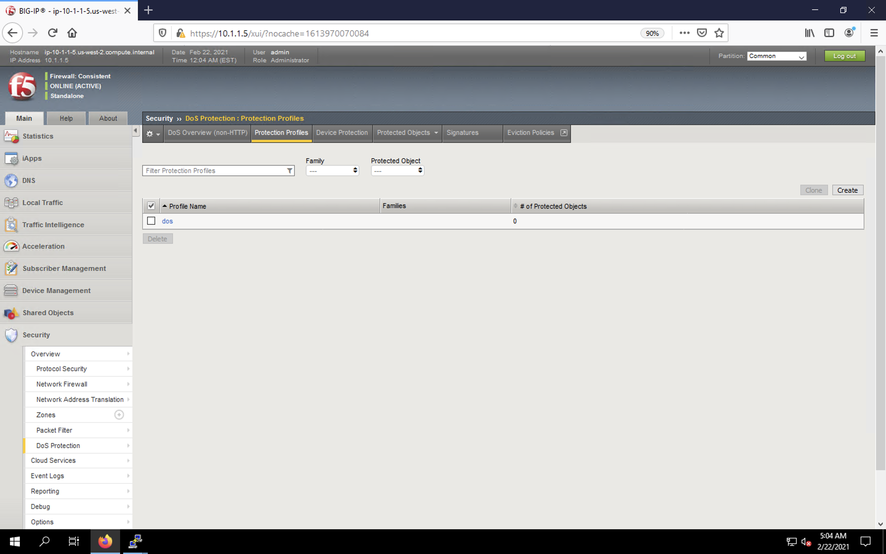
   
2. Click **Create** to create a new profile.

3. Enter the name *dns-dos-profile* into the form. Set the **Threshold Sensitivity** to *high* and check the box next to **DNS**.

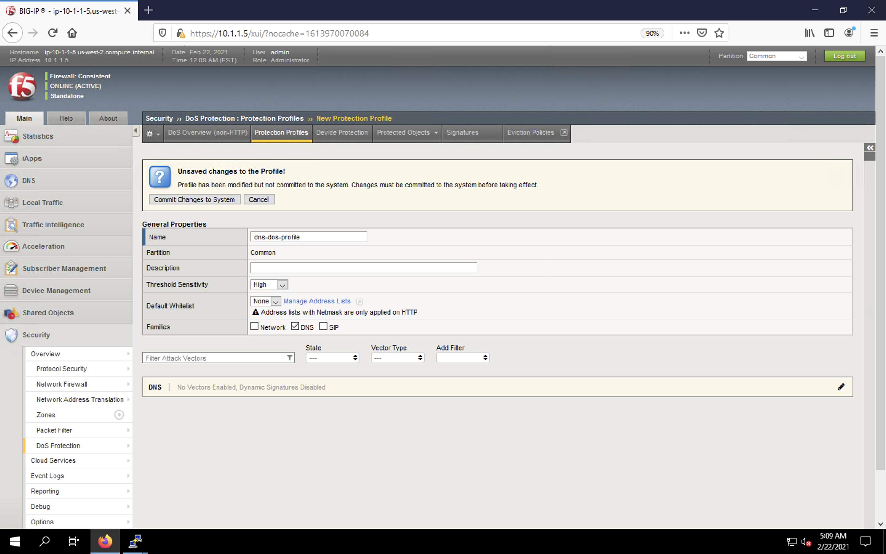

4. Click on the DNS section title in the vector list at the bottom of the screen as shown below.

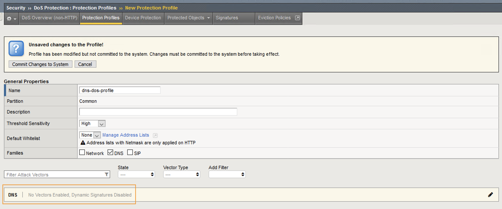

5. In this list, check the **DNS A Query** vector in the list to open the vector configuration menu.

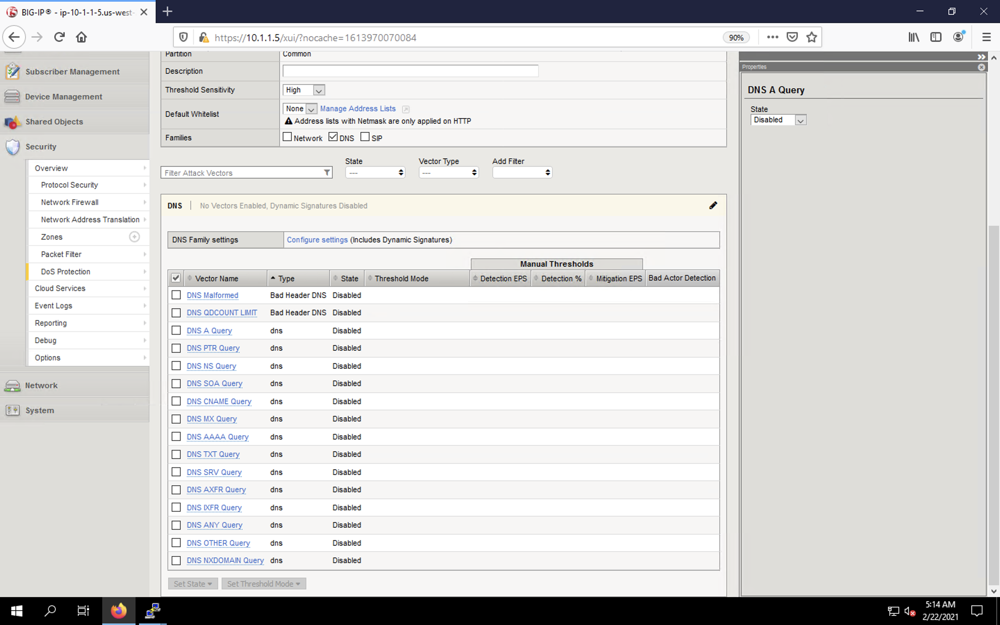

6. Set the **State** to *Mitigate*. Choose *Fully Manual* as the **Threshold Mode**. Set the **Detection Threshold EPS** to 80%-ish of the safe QPS value you determined earlier in the lab. Set the **Detection Threshold %** to *Infinite*. Set the **Mitigation Threshold EPS** to the safe QPS value. Check the box for **Simulate Auto Threshold**.

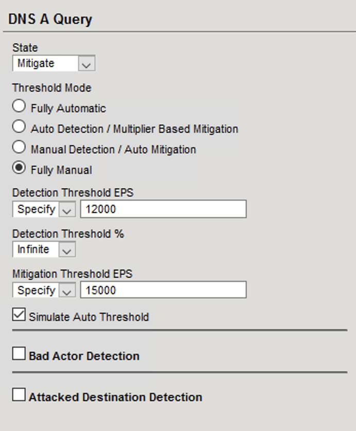

7. Scroll to the top of the screen and click **Commit Changes to System**.

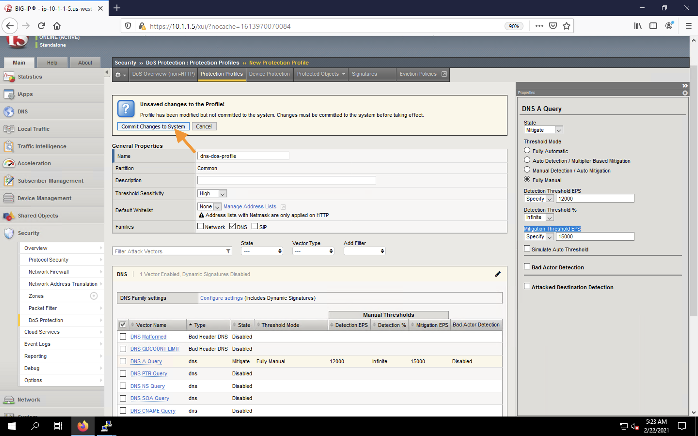

Attaching a DoS Profile
-----------------------

We’ll attach the DoS profile to the virtual server that we configured to manage DNS traffic.

1. Navigate to **Security** > **DoS Protection** > **Protected Objects** > **Protected Objects List**.

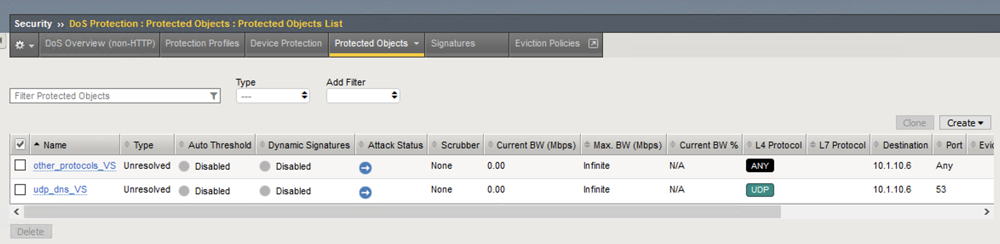

2. Click on the *udp_dns_VS* virtual server name. The properties configuration menu should appear on the right. If the statistics dashboard appears below, click again directly on the object name in the menu.

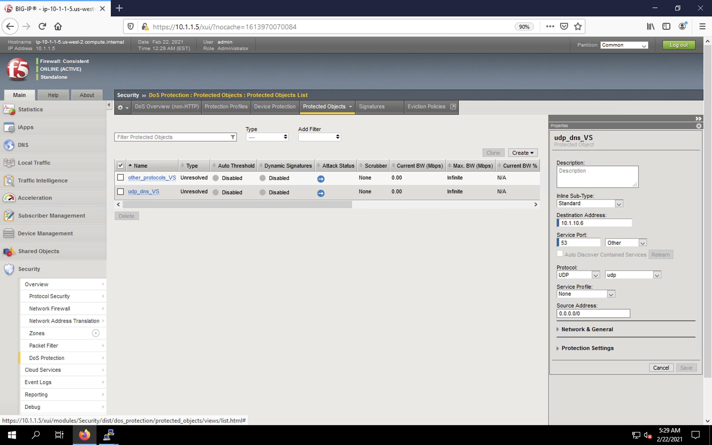

3. Change the **Service Profile** to *dns*. 

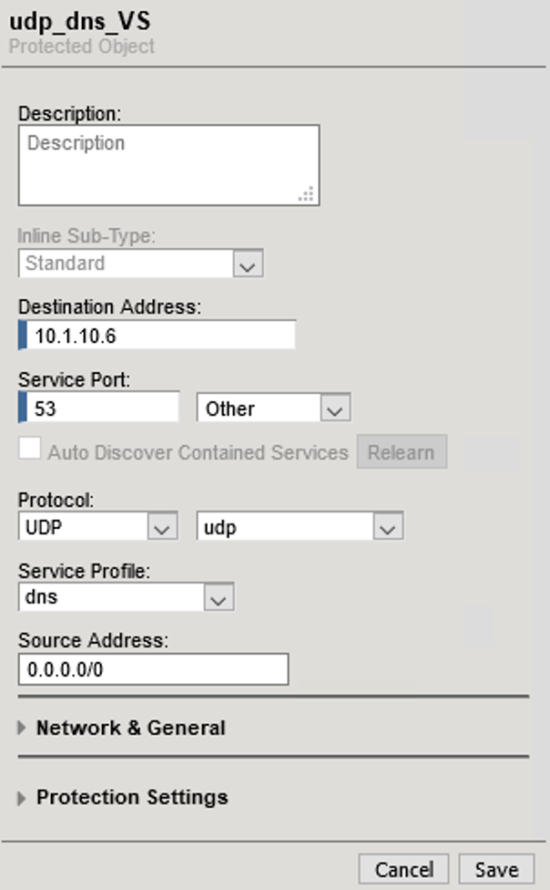

4. Expand **Network & General** and add the *dns-dos-logging-profile* logging profile from the **Available** to **Selected** column.

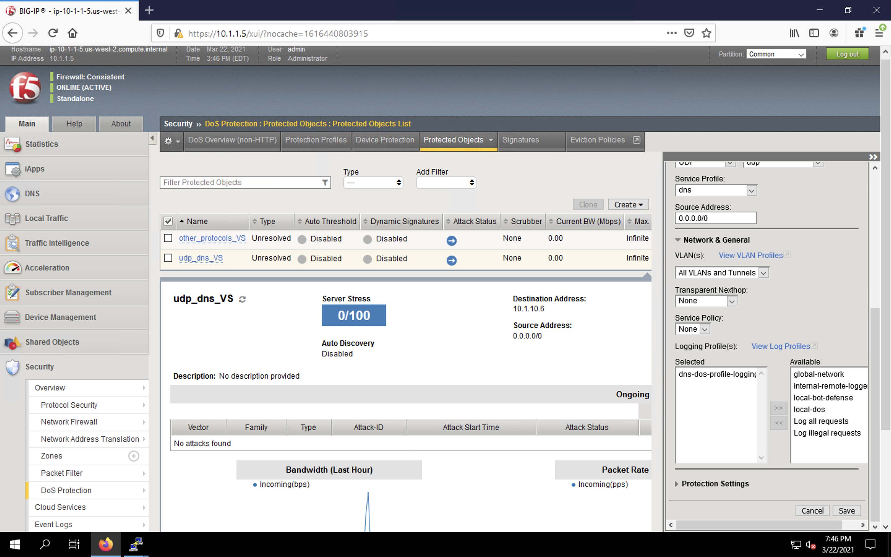

5. Expand **Protection Settings** and set the **Protection Profile** to *dns-dos-profile*.

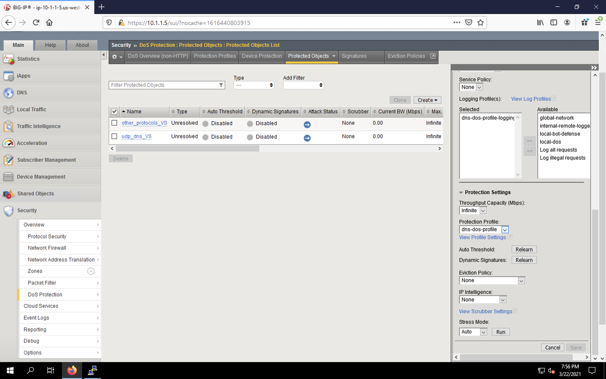

6. Click **Save**. 

