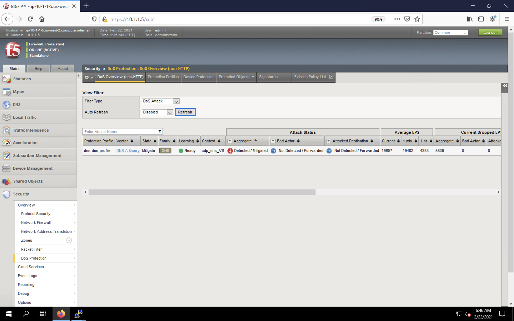
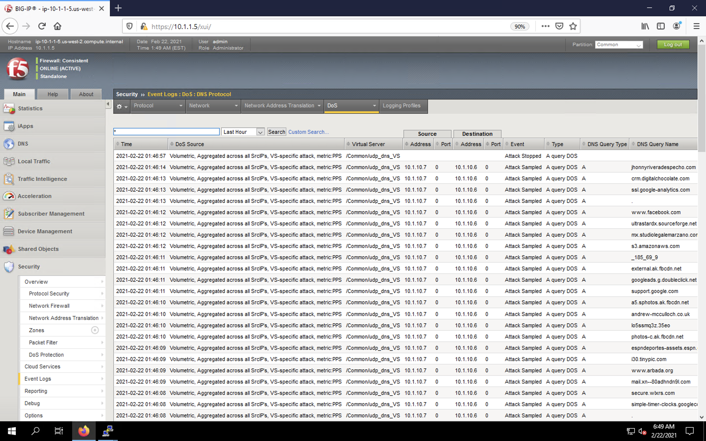
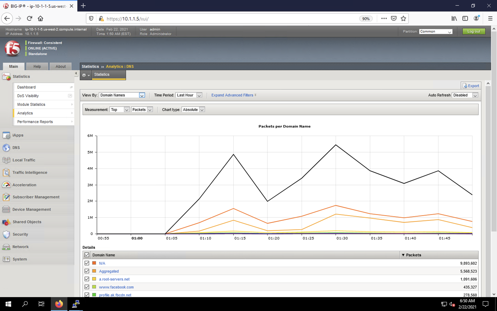

Simulate a DNS DDoS Attack
==========================

DNS flood (or DoS) attacks
--------------------------

Denial-of-service (DoS) or flood attacks attempt to overwhelm a system by 
sending thousands of requests that are either malformed or simply attempt to 
overwhelm a system using a particular DNS query type or protocol extension, 
or a particular SIP request type. The BIG-IP system allows you to track such 
attacks, using the DoS Protection profile.

1. Restore the SSH session to the victim server and ensure the ``top`` utility is running.
2. Now we're going to run a longer attack against the DNS server from the attack host using the attack volume of 10x the safe QPS level: 
    - ``dnsperf -s 10.1.10.6 -d queryfile-example-current -b 8192000 -c 60 -t 30 -T 20 -l 90 -q 1000000 -Q 1500000``.
3. While the attack is running, navigate to **Security** > **Overview** > **DoS Protection** > **DoS Overview (Non-HTTP)**. You will see that the attack status has changed to detected/mitigated, with current attack events per second (EPS) and drops EPS values. Click **Refresh** to update these values on demand.

4. After the attack, navigate to **Security** > **Event Logs** > **DoS** > **DNS Protocol**. Observe the logs to see the mitigation actions taken by the BIG-IP.

5. Under the **Statistics** > **Analytics** > **DNS**, you can see graphs surrounding the traffic and attack details. Change between the *Domain Names*, *Query Types*, *Attack IDs*, *Transaction Outcomes* and other values in the **View By** drop-down to view various states. Observe the table holding TopN values below the chart.

