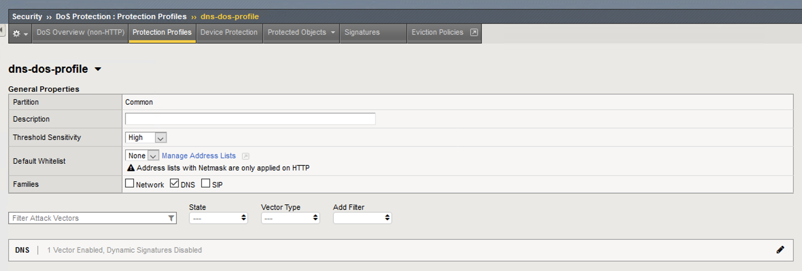
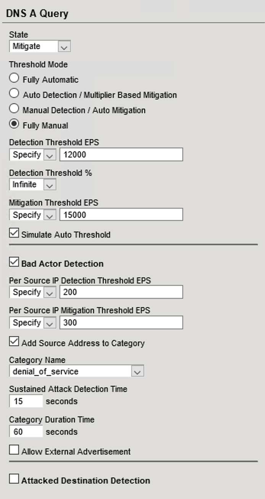
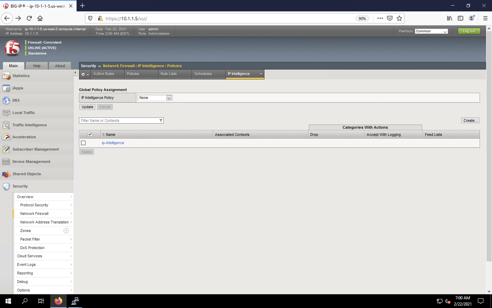
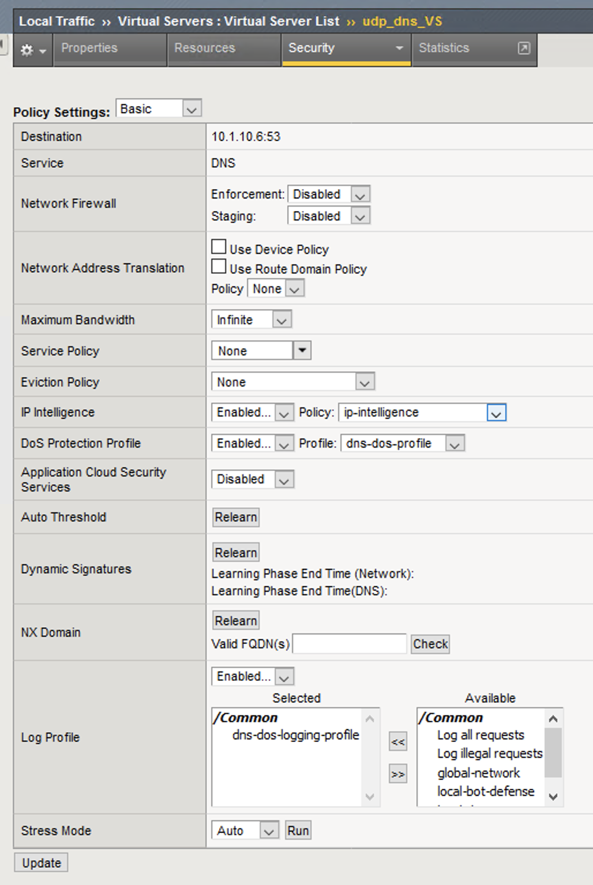
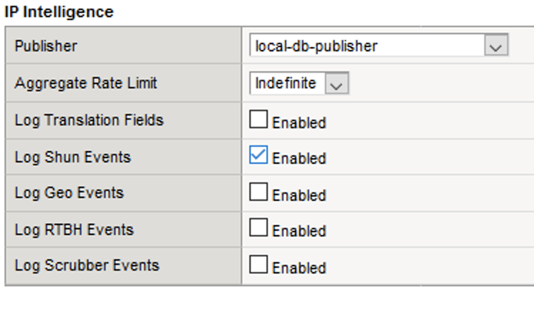
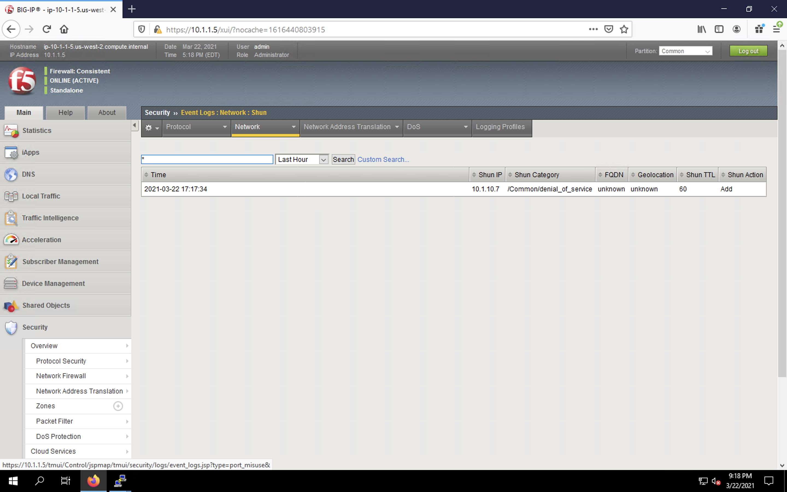

DNS DDoS Mitigations for Continued Service
==========================================

At this point, you’ve successfully configured the BIG-IP to limit the amount of 
DNS queries permitted to the back end server. Unfortunately, even valid DNS requests can 
be caught in the mitigation we’ve configured. There are further steps that can 
be taken to mitigate the attack that will allow non-malicious DNS queries.

You can also enable Bad Actor detection on a per-vector basis to identify IP 
addresses that engage in attacks where one IP address is targeting many 
destinations; the system can automatically blacklist Bad Actor IP addresses 
with specific thresholds and time limits. In addition, you can use Attacked 
Destination Detection to determine IP addresses that are being attacked from 
many sources (many to one attacks). The attacked addresses are added to a list 
and packets are rate limited to that attacked address.

Bad Actor Detection
-------------------

Bad actor detection allows us to completely block communications from malicious hosts at the BIG-IP, completely preventing those hosts from reaching the back-end servers. To demonstrate: 

1. Navigate to **Security** > **DoS Protection** > **Protection Profiles**. Click on the *dns-dos-profile* profile name.

2. Expand the *DNS Family Settings* vector list.
3. Click on the *DNS A Query* attack type name.
4. Modify the vector as follows:
      - **Bad Actor Detection**: *Checked*
      - **Per Source IP Detection Threshold EPS**: *200*
      - **Per Source IP Mitigation Threshold EPS**: *300*
      - **Add Source Address to Category**: *Checked*
      - **Category Name**: *denial_of_service*
      - **Sustained Attack Detection Time**: *15 seconds*
      - **Category Duration Time**: *60 seconds*

5. Scroll to the top of the page and click **Commit Changes to System** to save your changes.
6. Navigate to **Security** > **Network Firewall** > **IP Intelligence** > **Policies**.

7. Create a new IP Intelligence policy with the following values, leaving unspecified attributes at their default values:
      - **Name**: *dns-bad-actor-blocking*
      - **Default Action**: *Accept*
      - **Log Category Matches**: *Yes*
      - **Categories** > Click **Add**.
      - Select the *denial_of_service* **Category** and change the **Action** to *drop*.
            .. image:: _images/image046.png
                :alt:   screenshot
      - Click **Done Editing**.
            .. image:: _images/image047.png
                :alt:   screenshot

8. Click **Commit Changes to System**.
9. Navigate to **Local Traffic** > **Virtual Servers** > **Virtual Server List**.
10. Click on the *udp_dns_VS* virtual server name.
11. Click on the **Security** tab and select **Policies**.
12. Enable **IP Intelligence** and choose the *dns-bad-actor-blocking* policy.

13. Make sure you click **Update** to save your changes.
14. Navigate to **Security** > **Event Logs** > **Logging Profiles**.
15. Click the *global_network* logging profile name. We can only log shun events in the global profile.
16. Under the **Network Firewall** tab, set the **IP Intelligence Publisher** to *local-db-publisher* and check **Log Shun Events**.

17. Click **Update** to save your changes.
18. Click the *dns-dos-profile-logging* logging profile name.
19. Check *Enabled* next to **Network Firewall**.
20. Under the **Network Firewall** tab, change the **Network Firewall and IP Intelligence Publisher** to *local-db-publisher* and click **Update**.
21. Bring into view the Victim Server SSH session running the top utility to monitor CPU utilization.
22. On the Attack Server host, launch the DNS attack once again using the following syntax: 
    - ``dnsperf -s 10.1.10.6 -d queryfile-example-current -b 8192000 -c 60 -t 30 -T 20 -l 90 -q 1000000 -Q 1500000``
23. You’ll notice CPU utilization on the victim server begin to climb, but after a short time, drop to non-traffic levels. The attack host will show that queries are timing out as shown below. This is due to the BIG-IP blacklisting the bad actor.
24. Navigate to **Security** > **Event Logs** > **Network** > **Shun**. This screen shows the bad actor being added to (and later deleted from) the shun category.

25. Navigate to **Security** > **Reporting** > **Protocol** > **DNS**. Change the View By drop-down to view various statistics around the DNS traffic and attacks.
26. Navigate to **Security** > **Reporting** > **DoS** > **Dashboard** to view an overview of the DoS attacks and timeline. You can select filters in the filter pane to highlight specific attacks.
27. Finally, navigate to **Security** > **Reporting** > **DoS** > **Analysis**. View detailed statistics around each attack.