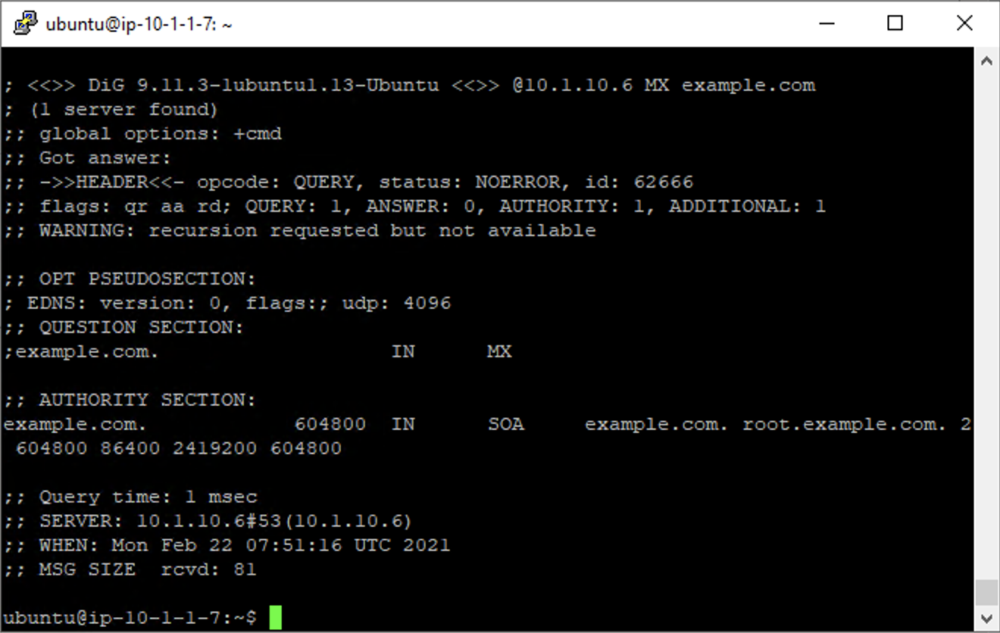
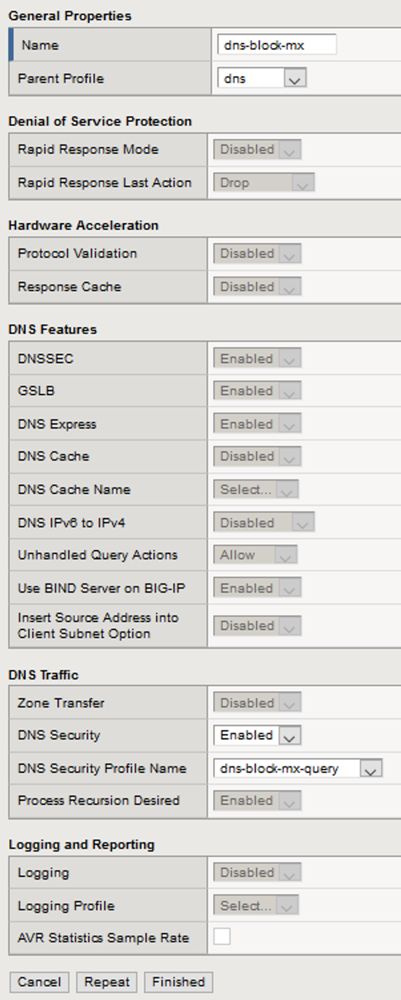
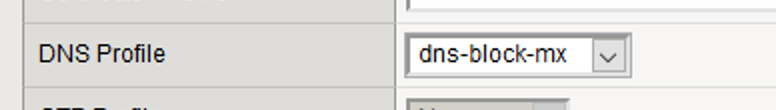
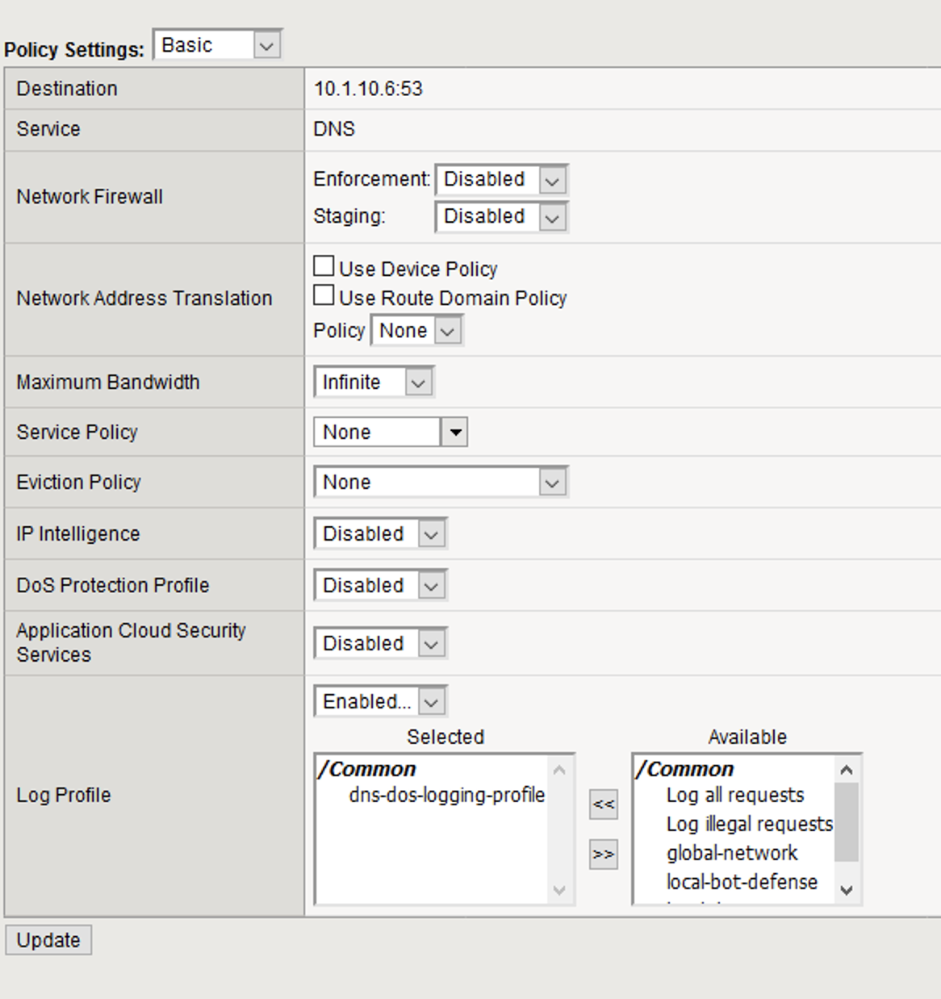
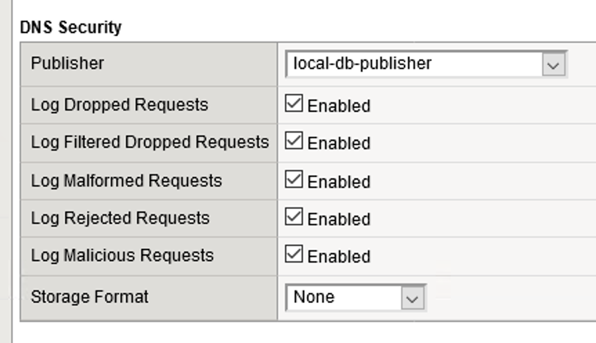
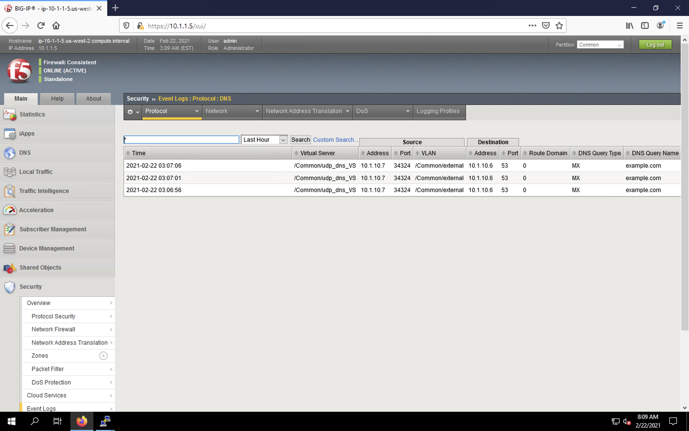

Filtering specific DNS operations
=================================

Protocol exploits
-----------------

Attackers can send DNS requests using unusual DNS query types or OpCodes. The 
BIG-IP system can be configured to allow or deny certain DNS query types, and 
to deny specific DNS OpCodes. When you configure the system to deny such protocol 
exploits, the system tracks these events as attacks. This configuration is set 
in the DNS Security profile.

To demonstrate, we will block MX queries from reaching our DNS server.

1. Open the SSH session to the attack host.
2. Perform an MX record lookup by issuing the following command:  
    - ``dig @10.1.10.6 MX example.com``

3. The server doesn’t have a record for this domain. This server doesn’t have MX records, so those requests should be filtered.
4. Navigate to **Security** > **Protocol** **Security** > **Security Profiles** > **DNS** and create a new DNS security profile with the following values, leaving unspecified attributes at their default value:
     - **Name**: *dns-block-mx*-query
     - **Query Type Filter**: move *mx* from **Available** to **Active**
5. Navigate to **Local Traffic** > **Profiles** > **Services** > **DNS**.  
    .. note:: If you are mousing over the services, DNS may not show up on the list.  Select Services and then use the pulldown menu on services to select DNS.
6. Create a new DNS services profile with the following values, leaving unspecified values at their default values:
    - **Name**: *dns-block-mx*
    - Under the **DNS Traffic** section**DNS Security**: *Enabled*
    - **DNS Security Profile Name**: *dns-block-mx-query*

7. Navigate to **Local Traffic** > **Virtual Servers** > **Virtual Server List**.
8. Click on the *udp_dns_VS* virtual server name.
9. In the Configuration section, change the view to **Advanced**.
10. Set the **DNS Profile** to *dns-block-mx*.

11. Navigate to the **Security** > **Policies** section of the virtual server configuration and remove the **IP Intelligence** and **DoS Protection Profile** profiles.

12. Click **Update** to save your settings.
13. Navigate to **Security** > **Event Logs** > **Logging Profiles**.
14. Click on the *dns-dos-profile-logging* logging profile name.
15. Check *Enabled* next to **Protocol Security**.
16. In the **Protocol Security** tab, set the DNS Security Publisher to *local-db-publisher* and check all five of the request log types.

17. Make sure that you click **Update** to save your settings.
18. Return to the Attack Server SSH session and re-issue the MX query command: 
    - ``dig @10.1.10.6 MX example.com``
19. The query hangs as the BIG-IP is blocking the MX lookup.
20. Navigate to **Security** > **Event Logs** > **Protocol** > **DNS**. Observer the MX query drops.

This concludes the DNS portion of the lab. On the victim server, stop the top utility by pressing CTRL + C.