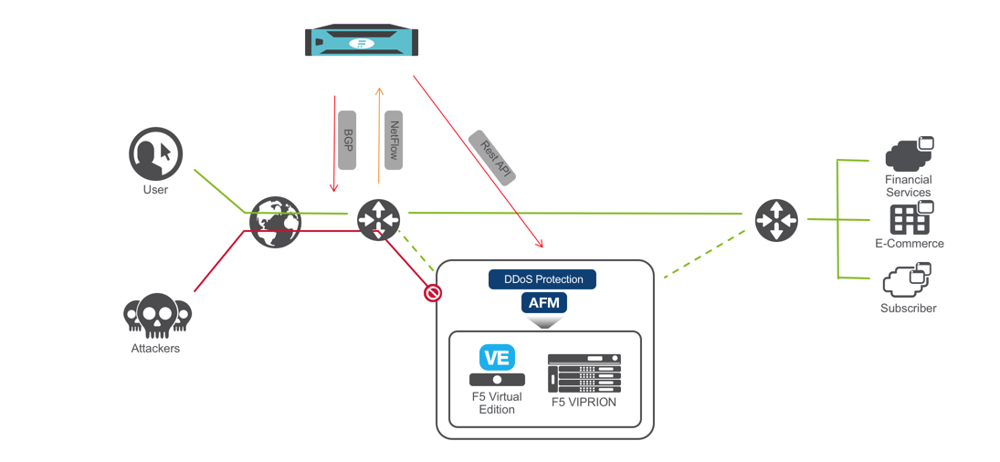
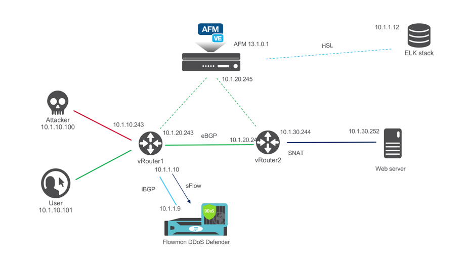

Deployment use case
===================

A Joint F5 + Flowmon solution is deployed “out-of-path” and provides an
out-of-band DDoS mitigation of L3-4 volumetric DDoS attacks. It’s a
simple and convenient solution that leverages the existing IT
infrastructure to provide traffic flow information.

Flowmon Collector appliance receives NetFlow/sFlow/IPFIX from edge
routers while Flowmon DDoS Defender uses i/eBGP/Flowspec to route the
traffic to F5 DHD/AFM appliance. F5 DHD/AFM DDoS profile, VS and other
parameters provisioned dynamically through iControl REST.

|image1|

                `Pic.1 Solution Diagram`

Lab blueprint setup
===================

Lab blueprint is deployed in Oracle Ravello cloud with access from F5
UDF portal. All Flowmon elements are pre-configured, F5 AFM VE resources
are provisioned and network is configured.

|image2|

             `Pic.2 Lab blueprint`

Licensing
=========

BIG-IP is licensed automatically.

Evaluation license has been applied to Flowmon Collector/DDoS Defender.
Please contact Lab admin if there are issues with any lab elements.

Other considerations
====================

.. NOTE:: Router1 is configured to export sFlow with sampling rate of 1

.. NOTE:: Learn about sFlow:

    https://sflow.org

